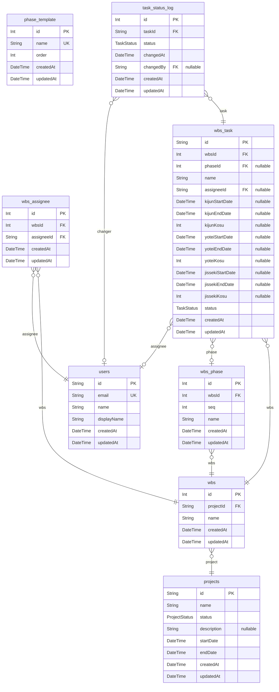

# ER図
> Generated by [`prisma-markdown`](https://github.com/samchon/prisma-markdown)

- [default](#default)

## default

### `projects`

**Properties**
  - `id`: 
  - `name`: 
  - `status`: 
  - `description`: 
  - `startDate`: 
  - `endDate`: 
  - `createdAt`: 
  - `updatedAt`: 

### `users`

**Properties**
  - `id`: 
  - `email`: 
  - `name`: 
  - `displayName`: 
  - `createdAt`: 
  - `updatedAt`: 

### `wbs`

**Properties**
  - `id`: 
  - `projectId`: 
  - `name`: 
  - `createdAt`: 
  - `updatedAt`: 

### `wbs_assignee`

**Properties**
  - `id`: 
  - `wbsId`: 
  - `assigneeId`: 
  - `createdAt`: 
  - `updatedAt`: 

### `wbs_phase`

**Properties**
  - `id`: 
  - `wbsId`: 
  - `seq`: 
  - `name`: 
  - `createdAt`: 
  - `updatedAt`: 

### `phase_template`

**Properties**
  - `id`: 
  - `name`: 
  - `order`: 
  - `createdAt`: 
  - `updatedAt`: 

### `wbs_task`

**Properties**
  - `id`: 
  - `wbsId`: 
  - `phaseId`: 
  - `name`: 
  - `assigneeId`: 
  - `kijunStartDate`: 
  - `kijunEndDate`: 
  - `kijunKosu`: 
  - `yoteiStartDate`: 
  - `yoteiEndDate`: 
  - `yoteiKosu`: 
  - `jissekiStartDate`: 
  - `jissekiEndDate`: 
  - `jissekiKosu`: 
  - `status`: 
  - `createdAt`: 
  - `updatedAt`: 

### `task_status_log`

**Properties**
  - `id`: 
  - `taskId`: 
  - `status`: 
  - `changedAt`: 
  - `changedBy`: 
  - `createdAt`: 
  - `updatedAt`: 