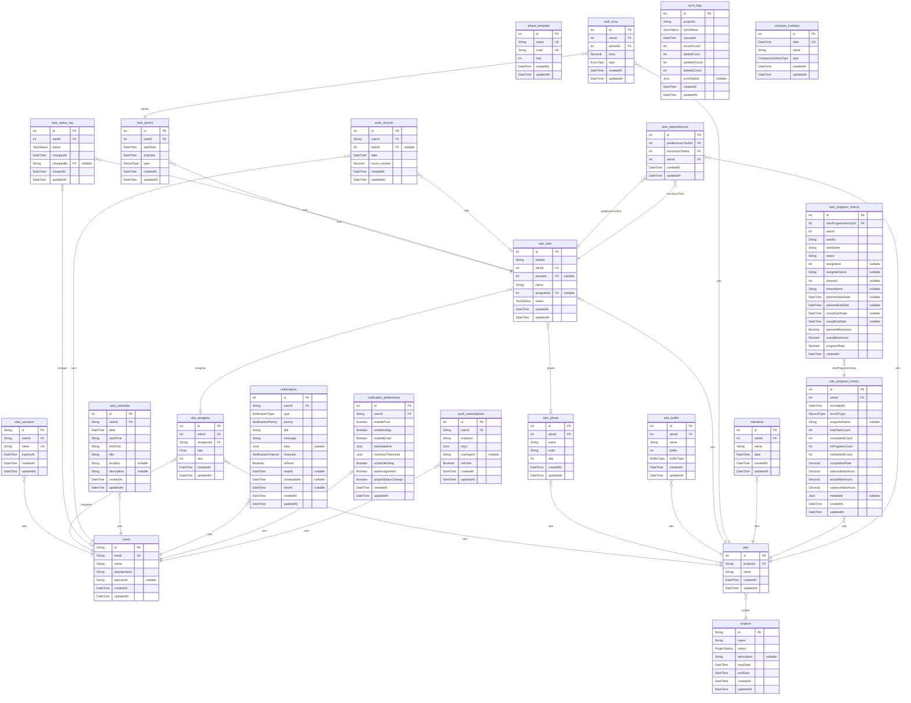

# ER図
> Generated by [`prisma-markdown`](https://github.com/samchon/prisma-markdown)

- [default](#default)

## default

### `projects`

**Properties**
  - `id`: 
  - `name`: 
  - `status`: 
  - `description`: 
  - `startDate`: 
  - `endDate`: 
  - `createdAt`: 
  - `updatedAt`: 

### `users`

**Properties**
  - `id`: 
  - `email`: 
  - `name`: 
  - `displayName`: 
  - `password`: 
  - `createdAt`: 
  - `updatedAt`: 

### `user_sessions`

**Properties**
  - `id`: 
  - `userId`: 
  - `token`: 
  - `expiresAt`: 
  - `createdAt`: 
  - `updatedAt`: 

### `wbs`

**Properties**
  - `id`: 
  - `projectId`: 
  - `name`: 
  - `createdAt`: 
  - `updatedAt`: 

### `wbs_assignee`

**Properties**
  - `id`: 
  - `wbsId`: 
  - `assigneeId`: 
  - `rate`: 
  - `seq`: 
  - `createdAt`: 
  - `updatedAt`: 

### `wbs_phase`

**Properties**
  - `id`: 
  - `wbsId`: 
  - `name`: 
  - `code`: 
  - `seq`: 
  - `createdAt`: 
  - `updatedAt`: 

### `phase_template`

**Properties**
  - `id`: 
  - `name`: 
  - `code`: 
  - `seq`: 
  - `createdAt`: 
  - `updatedAt`: 

### `wbs_buffer`

**Properties**
  - `id`: 
  - `wbsId`: 
  - `name`: 
  - `buffer`: 
  - `bufferType`: 
  - `createdAt`: 
  - `updatedAt`: 

### `wbs_task`

**Properties**
  - `id`: 
  - `taskNo`: 
  - `wbsId`: 
  - `phaseId`: 
  - `name`: 
  - `assigneeId`: 
  - `status`: 
  - `createdAt`: 
  - `updatedAt`: 

### `task_period`

**Properties**
  - `id`: 
  - `taskId`: 
  - `startDate`: 
  - `endDate`: 
  - `type`: 
  - `createdAt`: 
  - `updatedAt`: 

### `task_kosu`

**Properties**
  - `id`: 
  - `wbsId`: 
  - `periodId`: 
  - `kosu`: 
  - `type`: 
  - `createdAt`: 
  - `updatedAt`: 

### `task_status_log`

**Properties**
  - `id`: 
  - `taskId`: 
  - `status`: 
  - `changedAt`: 
  - `changedBy`: 
  - `createdAt`: 
  - `updatedAt`: 

### `milestone`

**Properties**
  - `id`: 
  - `wbsId`: 
  - `name`: 
  - `date`: 
  - `createdAt`: 
  - `updatedAt`: 

### `work_records`

**Properties**
  - `id`: 
  - `userId`: 
  - `taskId`: 
  - `date`: 
  - `hours_worked`: 
  - `createdAt`: 
  - `updatedAt`: 

### `user_schedule`

**Properties**
  - `id`: 
  - `userId`: 
  - `date`: 
  - `startTime`: 
  - `endTime`: 
  - `title`: 
  - `location`: 
  - `description`: 
  - `createdAt`: 
  - `updatedAt`: 

### `notifications`

**Properties**
  - `id`: 
  - `userId`: 
  - `type`: 
  - `priority`: 
  - `title`: 
  - `message`: 
  - `data`: 
  - `channels`: 
  - `isRead`: 
  - `readAt`: 
  - `scheduledAt`: 
  - `sentAt`: 
  - `createdAt`: 
  - `updatedAt`: 

### `notification_preferences`

**Properties**
  - `id`: 
  - `userId`: 
  - `enablePush`: 
  - `enableInApp`: 
  - `enableEmail`: 
  - `taskDeadline`: 
  - `manhourThreshold`: 
  - `scheduleDelay`: 
  - `taskAssignment`: 
  - `projectStatusChange`: 
  - `createdAt`: 
  - `updatedAt`: 

### `push_subscriptions`

**Properties**
  - `id`: 
  - `userId`: 
  - `endpoint`: 
  - `keys`: 
  - `userAgent`: 
  - `isActive`: 
  - `createdAt`: 
  - `updatedAt`: 

### `wbs_progress_history`

**Properties**
  - `id`: 
  - `wbsId`: 
  - `recordedAt`: 
  - `recordType`: 
  - `snapshotName`: 
  - `totalTaskCount`: 
  - `completedCount`: 
  - `inProgressCount`: 
  - `notStartedCount`: 
  - `completionRate`: 
  - `plannedManHours`: 
  - `actualManHours`: 
  - `varianceManHours`: 
  - `metadata`: 
  - `createdAt`: 
  - `updatedAt`: 

### `task_progress_history`

**Properties**
  - `id`: 
  - `wbsProgressHistoryId`: 
  - `taskId`: 
  - `taskNo`: 
  - `taskName`: 
  - `status`: 
  - `assigneeId`: 
  - `assigneeName`: 
  - `phaseId`: 
  - `phaseName`: 
  - `plannedStartDate`: 
  - `plannedEndDate`: 
  - `actualStartDate`: 
  - `actualEndDate`: 
  - `plannedManHours`: 
  - `actualManHours`: 
  - `progressRate`: 
  - `createdAt`: 

### `task_dependencies`

**Properties**
  - `id`: 
  - `predecessorTaskId`: 
  - `successorTaskId`: 
  - `wbsId`: 
  - `createdAt`: 
  - `updatedAt`: 

### `sync_logs`

**Properties**
  - `id`: 
  - `projectId`: 
  - `syncStatus`: 
  - `syncedAt`: 
  - `recordCount`: 
  - `addedCount`: 
  - `updatedCount`: 
  - `deletedCount`: 
  - `errorDetails`: 
  - `createdAt`: 
  - `updatedAt`: 

### `company_holidays`

**Properties**
  - `id`: 
  - `date`: 
  - `name`: 
  - `type`: 
  - `createdAt`: 
  - `updatedAt`: 