# ER図 (MySQL - Geppo)
> Generated by [`prisma-markdown`](https://github.com/samchon/prisma-markdown)

- [default](#default)

## default

```mermaid
erDiagram
"geppo" {
  String MEMBER_ID
  String GEPPO_YYYYMM
  Int ROW_NO
  String COMPANY_NAME "nullable"
  String MEMBER_NAME "nullable"
  String PROJECT_ID "nullable"
  String PROJECT_SUB_ID "nullable"
  String WBS_NO "nullable"
  String WBS_NAME "nullable"
  String WORK_NAME "nullable"
  String WORK_STATUS "nullable"
  Float TOTAL "nullable"
  Float DAY01 "nullable"
  Float DAY02 "nullable"
  Float DAY03 "nullable"
  Float DAY04 "nullable"
  Float DAY05 "nullable"
  Float DAY06 "nullable"
  Float DAY07 "nullable"
  Float DAY08 "nullable"
  Float DAY09 "nullable"
  Float DAY10 "nullable"
  Float DAY11 "nullable"
  Float DAY12 "nullable"
  Float DAY13 "nullable"
  Float DAY14 "nullable"
  Float DAY15 "nullable"
  Float DAY16 "nullable"
  Float DAY17 "nullable"
  Float DAY18 "nullable"
  Float DAY19 "nullable"
  Float DAY20 "nullable"
  Float DAY21 "nullable"
  Float DAY22 "nullable"
  Float DAY23 "nullable"
  Float DAY24 "nullable"
  Float DAY25 "nullable"
  Float DAY26 "nullable"
  Float DAY27 "nullable"
  Float DAY28 "nullable"
  Float DAY29 "nullable"
  Float DAY30 "nullable"
  Float DAY31 "nullable"
  String FILE_NAME "nullable"
  DateTime FILE_UPDATE_DATE "nullable"
  DateTime UPDATE_DATE
}
"calendar" {
  DateTime CALDATE PK
}
"cost_table" {
  String file_name
  String sheet_name
  String project_name
  String type
  String yyyymm
  Int row_no
  String member
  Float manhour
}
"evm_phase_sum" {
  Int ID PK
  String PROJECT_ID "nullable"
  String PHASE "nullable"
  DateTime CALDATE "nullable"
  Float IPV "nullable"
  Float IBPV "nullable"
  Float PV "nullable"
  Float EV "nullable"
  Float AC "nullable"
}
"evm_status_rate" {
  String STATUS PK
  Int SEQ
  Float RATE "nullable"
}
"evm_sum" {
  Int ID PK
  String PROJECT_ID "nullable"
  String PHASE "nullable"
  String KINO_SBT "nullable"
  String TANTO "nullable"
  DateTime CALDATE "nullable"
  Float IPV "nullable"
  Float IBPV "nullable"
  Float PV "nullable"
  Float EV "nullable"
  Float AC "nullable"
  Float BAC "nullable"
  Float SV "nullable"
  Float CV "nullable"
  Float SPI "nullable"
  Float CPI "nullable"
  Float EAC "nullable"
}
"geppo_day" {
  String MEMBER_ID
  String GEPPO_YYYYMM
  DateTime WORK_DAY
  Int ROW_NO
  String COMPANY_NAME "nullable"
  String MEMBER_NAME "nullable"
  String PROJECT_ID "nullable"
  String PROJECT_SUB_ID "nullable"
  String WBS_NO "nullable"
  String WBS_NAME "nullable"
  String WORK_NAME "nullable"
  Float WORK_TIME "nullable"
  String FILE_NAME "nullable"
  DateTime FILE_UPDATE_DATE "nullable"
  DateTime UPDATE_DATE
}
"member" {
  Int ID PK
  String PERSONAL_CD "nullable"
  String NAME_FIRST "nullable"
  String NAME_LAST "nullable"
  Int COMPANY_ID "nullable"
}
"phase" {
  Int ID PK
  String NAME "nullable"
  String PHASE_TYPE "nullable"
  Int SEQ "nullable"
}
"project" {
  Int ID PK
  String NAME "nullable"
  Int SEQ "nullable"
}
"routine_work" {
  String member
  String task
  Float manhour
}
"shain_tokyu_tanka" {
  String tanka_yyyy
  String tanka_ki
  String tokyu
  Int tanka "nullable"
  Int zangyo_tanka "nullable"
}
"wbs" {
  Int ID PK
  String FILE_NAME "nullable"
  Int ROW_NO "nullable"
  String PROJECT_ID "nullable"
  String PROJECT_NAME "nullable"
  String WBS_ID "nullable"
  String PHASE "nullable"
  String ACTIVITY "nullable"
  String TASK "nullable"
  String KINO_SBT "nullable"
  String SUBSYSTEM "nullable"
  String TANTO "nullable"
  String TANTO_REV "nullable"
  DateTime KIJUN_START_DATE "nullable"
  DateTime KIJUN_END_DATE "nullable"
  Float KIJUN_KOSU "nullable"
  Float KIJUN_KOSU_BUFFER "nullable"
  DateTime YOTEI_START_DATE "nullable"
  DateTime YOTEI_END_DATE "nullable"
  Float YOTEI_KOSU "nullable"
  DateTime JISSEKI_START_DATE "nullable"
  DateTime JISSEKI_END_DATE "nullable"
  Float JISSEKI_KOSU "nullable"
  String STATUS "nullable"
  DateTime IPV_DATE "nullable"
  DateTime IBPV_DATE "nullable"
  DateTime PV_DATE "nullable"
  DateTime EV_DATE "nullable"
  DateTime AC_DATE "nullable"
  Float IPV_KOSU "nullable"
  Float IBPV_KOSU "nullable"
  Float PV_KOSU "nullable"
  Float EV_KOSU "nullable"
  Float AC_KOSU "nullable"
  String BIKO "nullable"
  Float PROGRESS_RATE "nullable"
}
"wbs_member" {
  String member_id PK
  String member_name "nullable"
  String member_name_short "nullable"
  String member_type "nullable"
}
```

### `geppo`

**Properties**
  - `MEMBER_ID`: 
  - `GEPPO_YYYYMM`: 
  - `ROW_NO`: 
  - `COMPANY_NAME`: 
  - `MEMBER_NAME`: 
  - `PROJECT_ID`: 
  - `PROJECT_SUB_ID`: 
  - `WBS_NO`: 
  - `WBS_NAME`: 
  - `WORK_NAME`: 
  - `WORK_STATUS`: 
  - `TOTAL`: 
  - `DAY01`: 
  - `DAY02`: 
  - `DAY03`: 
  - `DAY04`: 
  - `DAY05`: 
  - `DAY06`: 
  - `DAY07`: 
  - `DAY08`: 
  - `DAY09`: 
  - `DAY10`: 
  - `DAY11`: 
  - `DAY12`: 
  - `DAY13`: 
  - `DAY14`: 
  - `DAY15`: 
  - `DAY16`: 
  - `DAY17`: 
  - `DAY18`: 
  - `DAY19`: 
  - `DAY20`: 
  - `DAY21`: 
  - `DAY22`: 
  - `DAY23`: 
  - `DAY24`: 
  - `DAY25`: 
  - `DAY26`: 
  - `DAY27`: 
  - `DAY28`: 
  - `DAY29`: 
  - `DAY30`: 
  - `DAY31`: 
  - `FILE_NAME`: 
  - `FILE_UPDATE_DATE`: 
  - `UPDATE_DATE`: 

### `calendar`

**Properties**
  - `CALDATE`: 

### `cost_table`

**Properties**
  - `file_name`: 
  - `sheet_name`: 
  - `project_name`: 
  - `type`: 
  - `yyyymm`: 
  - `row_no`: 
  - `member`: 
  - `manhour`: 

### `evm_phase_sum`

**Properties**
  - `ID`: 
  - `PROJECT_ID`: 
  - `PHASE`: 
  - `CALDATE`: 
  - `IPV`: 
  - `IBPV`: 
  - `PV`: 
  - `EV`: 
  - `AC`: 

### `evm_status_rate`

**Properties**
  - `STATUS`: 
  - `SEQ`: 
  - `RATE`: 

### `evm_sum`

**Properties**
  - `ID`: 
  - `PROJECT_ID`: 
  - `PHASE`: 
  - `KINO_SBT`: 
  - `TANTO`: 
  - `CALDATE`: 
  - `IPV`: 
  - `IBPV`: 
  - `PV`: 
  - `EV`: 
  - `AC`: 
  - `BAC`: 
  - `SV`: 
  - `CV`: 
  - `SPI`: 
  - `CPI`: 
  - `EAC`: 

### `geppo_day`

**Properties**
  - `MEMBER_ID`: 
  - `GEPPO_YYYYMM`: 
  - `WORK_DAY`: 
  - `ROW_NO`: 
  - `COMPANY_NAME`: 
  - `MEMBER_NAME`: 
  - `PROJECT_ID`: 
  - `PROJECT_SUB_ID`: 
  - `WBS_NO`: 
  - `WBS_NAME`: 
  - `WORK_NAME`: 
  - `WORK_TIME`: 
  - `FILE_NAME`: 
  - `FILE_UPDATE_DATE`: 
  - `UPDATE_DATE`: 

### `member`

**Properties**
  - `ID`: 
  - `PERSONAL_CD`: 
  - `NAME_FIRST`: 
  - `NAME_LAST`: 
  - `COMPANY_ID`: 

### `phase`

**Properties**
  - `ID`: 
  - `NAME`: 
  - `PHASE_TYPE`: 
  - `SEQ`: 

### `project`

**Properties**
  - `ID`: 
  - `NAME`: 
  - `SEQ`: 

### `routine_work`

**Properties**
  - `member`: 
  - `task`: 
  - `manhour`: 

### `shain_tokyu_tanka`

**Properties**
  - `tanka_yyyy`: 
  - `tanka_ki`: 
  - `tokyu`: 
  - `tanka`: 
  - `zangyo_tanka`: 

### `wbs`

**Properties**
  - `ID`: 
  - `FILE_NAME`: 
  - `ROW_NO`: 
  - `PROJECT_ID`: 
  - `PROJECT_NAME`: 
  - `WBS_ID`: 
  - `PHASE`: 
  - `ACTIVITY`: 
  - `TASK`: 
  - `KINO_SBT`: 
  - `SUBSYSTEM`: 
  - `TANTO`: 
  - `TANTO_REV`: 
  - `KIJUN_START_DATE`: 
  - `KIJUN_END_DATE`: 
  - `KIJUN_KOSU`: 
  - `KIJUN_KOSU_BUFFER`: 
  - `YOTEI_START_DATE`: 
  - `YOTEI_END_DATE`: 
  - `YOTEI_KOSU`: 
  - `JISSEKI_START_DATE`: 
  - `JISSEKI_END_DATE`: 
  - `JISSEKI_KOSU`: 
  - `STATUS`: 
  - `IPV_DATE`: 
  - `IBPV_DATE`: 
  - `PV_DATE`: 
  - `EV_DATE`: 
  - `AC_DATE`: 
  - `IPV_KOSU`: 
  - `IBPV_KOSU`: 
  - `PV_KOSU`: 
  - `EV_KOSU`: 
  - `AC_KOSU`: 
  - `BIKO`: 
  - `PROGRESS_RATE`: 

### `wbs_member`

**Properties**
  - `member_id`: 
  - `member_name`: 
  - `member_name_short`: 
  - `member_type`: 