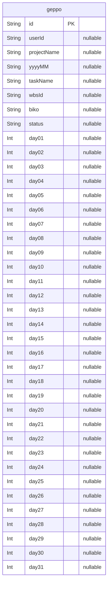

# ER図 (MySQL - Geppo)
> Generated by [`prisma-markdown`](https://github.com/samchon/prisma-markdown)

- [default](#default)

## default

### `geppo`

**Properties**
  - `id`: 
  - `userId`: 
  - `projectName`: 
  - `yyyyMM`: 
  - `taskName`: 
  - `wbsId`: 
  - `biko`: 
  - `status`: 
  - `day01`: 
  - `day02`: 
  - `day03`: 
  - `day04`: 
  - `day05`: 
  - `day06`: 
  - `day07`: 
  - `day08`: 
  - `day09`: 
  - `day10`: 
  - `day11`: 
  - `day12`: 
  - `day13`: 
  - `day14`: 
  - `day15`: 
  - `day16`: 
  - `day17`: 
  - `day18`: 
  - `day19`: 
  - `day20`: 
  - `day21`: 
  - `day22`: 
  - `day23`: 
  - `day24`: 
  - `day25`: 
  - `day26`: 
  - `day27`: 
  - `day28`: 
  - `day29`: 
  - `day30`: 
  - `day31`: 