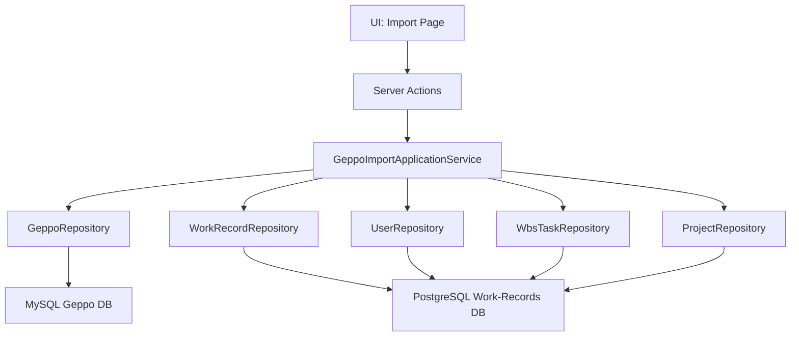

# Geppo テーブルから Work-Records へのインポート機能 設計書

## 1. 概要

MySQLのgeppoテーブルから作業実績データを取得し、PostgreSQLのwork-recordsテーブルに変換・インポートする機能を実装する。

## 2. 現状分析

### 2.1 Geppoテーブル構造（MySQL）
```sql
-- geppoテーブル（月報システム）
MEMBER_ID      VARCHAR(15)   -- メンバーID（複合主キー）
GEPPO_YYYYMM   VARCHAR(6)    -- 年月（複合主キー）
ROW_NO         INT           -- 行番号（複合主キー）
COMPANY_NAME   VARCHAR(50)   -- 会社名
MEMBER_NAME    VARCHAR(20)   -- メンバー名
PROJECT_ID     VARCHAR(50)   -- プロジェクトID
PROJECT_SUB_ID VARCHAR(20)   -- サブプロジェクトID
WBS_NO         VARCHAR(20)   -- WBS番号
WBS_NAME       VARCHAR(100)  -- WBS名
WORK_NAME      VARCHAR(100)  -- 作業名
WORK_STATUS    VARCHAR(20)   -- 作業ステータス
day01          INT           -- 1日の作業時間（分単位）
day02          INT           -- 2日の作業時間（分単位）
...
day31          INT           -- 31日の作業時間（分単位）
```

### 2.2 Work-Recordsテーブル構造（PostgreSQL）
```sql
-- work_recordsテーブル（プロジェクト管理システム）
id           SERIAL        -- 自動採番ID
userId       VARCHAR       -- ユーザーID
taskId       INT           -- タスクID（WbsTaskテーブルへの外部キー）
date         TIMESTAMP     -- 作業日
hours_worked INT           -- 作業時間（分単位）
createdAt    TIMESTAMP     -- 作成日時
updatedAt    TIMESTAMP     -- 更新日時
```

### 2.3 データ変換要件
1. **1対多変換**: Geppoの1レコード（月単位）→ Work-Recordsの複数レコード（日単位）
2. **日付変換**: `GEPPO_YYYYMM + 日付` → `date`
3. **ユーザーマッピング**: `MEMBER_ID` → `userId`
4. **プロジェクトマッピング**: `PROJECT_ID` → `projects.name`（プロジェクト存在確認用）
5. **タスクマッピング**: `WBS_NO` → `taskId`
6. **作業時間**: `day01-day31` → `hours_worked`（0分のレコードは除外）

## 3. アーキテクチャ設計

### 3.1 レイヤー構成
```
UI Layer (App Router)
├── /work-records/import/page.tsx                 # インポート実行UI
├── /work-records/import/import-actions.ts        # Server Actions

Application Layer
├── work-record-application-service.ts            # Work-Record用アプリケーションサービス
├── geppo-import-application-service.ts           # インポート専用アプリケーションサービス

Domain Layer
├── work-records/work-record.ts                   # Work-Recordドメインモデル
├── geppo-import/geppo-import-result.ts           # インポート結果ドメインモデル

Infrastructure Layer
├── work-record-prisma.repository.ts              # Work-Record用リポジトリ
├── geppo-import.service.ts                       # インポート変換サービス
```

### 3.2 依存関係


## 4. 詳細設計

### 4.1 ドメインモデル

#### 4.1.1 GeppoImportResult
```typescript
// src/domains/geppo-import/geppo-import-result.ts
export interface GeppoImportOptions {
  targetMonth: string        // YYYY-MM形式
  memberIds?: string[]       // 対象メンバーID（空の場合は全員）
  projectIds?: string[]      // 対象プロジェクトID（空の場合は全プロジェクト）
  targetProjectNames?: string[]  // インポート対象のprojects.name（複数選択可能）
  dryRun: boolean           // ドライラン実行フラグ
  updateMode: 'merge' | 'replace'  // merge: 既存データを更新、replace: 月単位で置換
}

export interface GeppoImportRecord {
  memberId: string
  memberName?: string
  projectId?: string
  wbsNo?: string
  workName?: string
  date: Date
  hoursWorked: number       // 分単位
}

export interface GeppoImportResult {
  totalGeppoRecords: number        // 処理対象Geppoレコード数
  totalWorkRecords: number         // 生成されたWorkRecordレコード数
  successCount: number             // 成功したレコード数
  errorCount: number               // エラーレコード数
  skippedCount: number             // スキップしたレコード数（作業時間0分など）
  createdCount: number             // 新規作成されたレコード数
  updatedCount: number             // 更新されたレコード数
  deletedCount: number             // 削除されたレコード数（replaceモード時）
  errors: GeppoImportError[]       // エラー詳細
  importedRecords: GeppoImportRecord[]  // インポートされたレコード（ドライラン時のみ）
}

export interface GeppoImportError {
  memberId: string
  projectId?: string
  date: Date
  errorType: 'USER_NOT_FOUND' | 'PROJECT_NOT_FOUND' | 'TASK_NOT_FOUND' | 'INVALID_DATA' | 'DB_ERROR'
  message: string
  originalData?: any
}
```

#### 4.1.2 WorkRecord拡張
```typescript
// src/domains/work-records/work-record.ts（既存を拡張）
export class WorkRecord {
  // 既存フィールド...

  // 新規作成メソッド
  public static createFromGeppo(args: {
    userId: string;
    taskId?: number;
    date: Date;
    hoursWorked: number;
  }): WorkRecord {
    return new WorkRecord({
      taskId: args.taskId,
      startDate: args.date,
      endDate: args.date,
      manHours: args.hoursWorked
    });
  }
}
```

### 4.2 アプリケーションサービス

#### 4.2.1 GeppoImportApplicationService
```typescript
// src/applications/geppo-import/geppo-import-application-service.ts
export interface IGeppoImportApplicationService {
  validateImportData(options: GeppoImportOptions): Promise<GeppoImportValidationResult>
  executeImport(options: GeppoImportOptions): Promise<GeppoImportResult>
  getImportPreview(options: GeppoImportOptions): Promise<GeppoImportPreview>
}

@injectable()
export class GeppoImportApplicationService implements IGeppoImportApplicationService {
  constructor(
    @inject(SYMBOL.IGeppoRepository) private geppoRepository: IGeppoRepository,
    @inject(SYMBOL.IWorkRecordRepository) private workRecordRepository: IWorkRecordRepository,
    @inject(SYMBOL.IUserRepository) private userRepository: IUserRepository,
    @inject(SYMBOL.IWbsTaskRepository) private wbsTaskRepository: IWbsTaskRepository,
    @inject(SYMBOL.IProjectRepository) private projectRepository: IProjectRepository
  ) {}

  async validateImportData(options: GeppoImportOptions): Promise<GeppoImportValidationResult> {
    // 1. 対象月のGeppoデータ存在確認
    // 2. インポート対象プロジェクトによるフィルタリング
    // 3. 対象ユーザーの存在確認
    // 4. 対象プロジェクトの存在確認
    // 5. 重複データの確認
    // 6. マッピング可能性の確認
  }

  async executeImport(options: GeppoImportOptions): Promise<GeppoImportResult> {
    // 1. バリデーション
    // 2. Geppoデータ取得
    // 3. インポート対象プロジェクトによるフィルタリング
    // 4. データ変換・マッピング
    // 5. 更新モードに応じた処理
    //    - merge: 既存データとの差分更新
    //    - replace: 対象月の既存データを削除してから全件挿入
    // 6. WorkRecordへの保存（トランザクション処理）
    // 7. 結果レポート生成
  }

  async getImportPreview(options: GeppoImportOptions): Promise<GeppoImportPreview> {
    // ドライラン実行して変換結果をプレビュー
  }
}
```

#### 4.2.2 WorkRecordApplicationService
```typescript
// src/applications/work-record/work-record-application-service.ts
export interface IWorkRecordApplicationService {
  findByDateRange(userId: string, startDate: Date, endDate: Date): Promise<WorkRecord[]>
  bulkCreate(workRecords: WorkRecord[]): Promise<void>
  bulkUpsert(workRecords: WorkRecord[]): Promise<{ created: number; updated: number }>
  deleteByDateRange(userId: string, startDate: Date, endDate: Date): Promise<number>
  deleteByUserAndDateRange(userIds: string[], startDate: Date, endDate: Date): Promise<number>
}
```

### 4.3 リポジトリ実装

#### 4.3.1 WorkRecordRepository
```typescript
// src/infrastructures/work-record/work-record-prisma.repository.ts
@injectable()
export class WorkRecordPrismaRepository implements IWorkRecordRepository {
  constructor(
    @inject(SYMBOL.PrismaClient) private prisma: PrismaClient
  ) {}

  async bulkCreate(workRecords: WorkRecord[]): Promise<void> {
    const data = workRecords.map(wr => ({
      userId: wr.userId,
      taskId: wr.taskId,
      date: wr.startDate,
      hours_worked: wr.manHours
    }))

    await this.prisma.workRecord.createMany({
      data,
      skipDuplicates: true
    })
  }

  async findByDateRange(userId: string, startDate: Date, endDate: Date): Promise<WorkRecord[]> {
    // 指定期間のWorkRecordを取得
  }

  async bulkUpsert(workRecords: WorkRecord[]): Promise<{ created: number; updated: number }> {
    // PostgreSQLのON CONFLICT構文を使用したupsert処理
    // 既存レコード（userId + date + taskId）の更新または新規作成
    const operations = workRecords.map(wr => ({
      userId: wr.userId,
      taskId: wr.taskId,
      date: wr.startDate,
      hours_worked: wr.manHours
    }))

    // upsert処理の実装（詳細は実装時に検討）
    return { created: 0, updated: 0 }
  }

  async deleteByDateRange(userId: string, startDate: Date, endDate: Date): Promise<number> {
    // 指定期間のWorkRecordを削除
    const result = await this.prisma.workRecord.deleteMany({
      where: {
        userId,
        date: {
          gte: startDate,
          lte: endDate
        }
      }
    })
    return result.count
  }

  async deleteByUserAndDateRange(userIds: string[], startDate: Date, endDate: Date): Promise<number> {
    // 複数ユーザーの指定期間のWorkRecordを削除（replaceモード用）
    const result = await this.prisma.workRecord.deleteMany({
      where: {
        userId: { in: userIds },
        date: {
          gte: startDate,
          lte: endDate
        }
      }
    })
    return result.count
  }
}
```

### 4.4 マッピング戦略

#### 4.4.1 プロジェクトフィルタリング・マッピング
```typescript
// src/infrastructures/geppo-import/project-mapping.service.ts
@injectable()
export class ProjectMappingService {
  constructor(
    @inject(SYMBOL.IProjectRepository) private projectRepository: IProjectRepository
  ) {}

  async createProjectMap(geppoProjectIds: string[]): Promise<Map<string, string>> {
    const projectMap = new Map<string, string>()
    
    // 1. 既存プロジェクトを取得
    const existingProjects = await this.projectRepository.findAll()
    
    // 2. geppo.PROJECT_ID と projects.name でマッピング
    for (const geppoProjectId of geppoProjectIds) {
      const matchedProject = existingProjects.find(p => 
        p.name === geppoProjectId ||           // 完全一致
        p.name.includes(geppoProjectId) ||     // 部分一致
        geppoProjectId.includes(p.name)        // 逆部分一致
      )
      
      if (matchedProject) {
        projectMap.set(geppoProjectId, matchedProject.id)
      } else {
        // プロジェクトが見つからない場合のログ
        console.warn(`Project mapping not found: ${geppoProjectId}`)
      }
    }
    
    return projectMap
  }

  async filterGeppoByTargetProjects(
    geppoRecords: Geppo[], 
    targetProjectNames?: string[]
  ): Promise<Geppo[]> {
    if (!targetProjectNames || targetProjectNames.length === 0) {
      // 対象プロジェクトが指定されていない場合は全件返す
      return geppoRecords
    }

    // 1. 対象プロジェクト名に対応するGeppo PROJECT_IDを特定
    const existingProjects = await this.projectRepository.findAll()
    const targetProjects = existingProjects.filter(p => 
      targetProjectNames.includes(p.name)
    )

    if (targetProjects.length === 0) {
      console.warn('No matching projects found for target project names:', targetProjectNames)
      return []
    }

    // 2. projects.name → geppo.PROJECT_ID の逆マッピングを作成
    const targetGeppoProjectIds = new Set<string>()
    
    for (const project of targetProjects) {
      // projects.name に対応する geppo.PROJECT_ID を検索
      const matchingGeppoProjectIds = geppoRecords
        .map(g => g.PROJECT_ID)
        .filter(Boolean)
        .filter(geppoProjectId => 
          project.name === geppoProjectId ||           // 完全一致
          project.name.includes(geppoProjectId!) ||    // 部分一致
          geppoProjectId!.includes(project.name)       // 逆部分一致
        )
      
      matchingGeppoProjectIds.forEach(id => targetGeppoProjectIds.add(id!))
    }

    // 3. 対象PROJECT_IDでフィルタリング
    return geppoRecords.filter(record => 
      record.PROJECT_ID && targetGeppoProjectIds.has(record.PROJECT_ID)
    )
  }

  async getAvailableProjectsForImport(targetMonth: string): Promise<ProjectImportOption[]> {
    // 1. 対象月のGeppoデータからプロジェクトを取得
    const geppoRecords = await this.geppoRepository.searchByMonth(targetMonth)
    const uniqueGeppoProjectIds = [...new Set(geppoRecords.map(g => g.PROJECT_ID).filter(Boolean))]
    
    // 2. マッピング可能なプロジェクトを特定
    const projectMap = await this.createProjectMap(uniqueGeppoProjectIds)
    const existingProjects = await this.projectRepository.findAll()
    
    // 3. インポート可能なプロジェクト一覧を作成
    const availableProjects: ProjectImportOption[] = []
    
    for (const project of existingProjects) {
      // このプロジェクトに対応するGeppoデータがあるかチェック
      const relatedGeppoProjectIds = uniqueGeppoProjectIds.filter(geppoProjectId =>
        project.name === geppoProjectId ||
        project.name.includes(geppoProjectId) ||
        geppoProjectId.includes(project.name)
      )
      
      if (relatedGeppoProjectIds.length > 0) {
        const recordCount = geppoRecords.filter(g => 
          g.PROJECT_ID && relatedGeppoProjectIds.includes(g.PROJECT_ID)
        ).length
        
        const userCount = new Set(
          geppoRecords
            .filter(g => g.PROJECT_ID && relatedGeppoProjectIds.includes(g.PROJECT_ID))
            .map(g => g.MEMBER_ID)
        ).size

        availableProjects.push({
          projectId: project.id,
          projectName: project.name,
          geppoProjectIds: relatedGeppoProjectIds,
          recordCount,
          userCount,
          mappingStatus: 'mapped'
        })
      }
    }
    
    return availableProjects
  }

  async validateProjectMapping(geppoRecords: Geppo[]): Promise<ProjectMappingValidation> {
    const uniqueProjectIds = [...new Set(geppoRecords.map(g => g.PROJECT_ID).filter(Boolean))]
    const projectMap = await this.createProjectMap(uniqueProjectIds)
    
    const mappedProjects = uniqueProjectIds.filter(id => projectMap.has(id))
    const unmappedProjects = uniqueProjectIds.filter(id => !projectMap.has(id))
    
    return {
      totalProjects: uniqueProjectIds.length,
      mappedCount: mappedProjects.length,
      unmappedCount: unmappedProjects.length,
      mappedProjects,
      unmappedProjects,
      mappingRate: mappedProjects.length / uniqueProjectIds.length
    }
  }
}

interface ProjectMappingValidation {
  totalProjects: number
  mappedCount: number
  unmappedCount: number
  mappedProjects: string[]
  unmappedProjects: string[]
  mappingRate: number  // 0.0 - 1.0
}

interface ProjectImportOption {
  projectId: string           // projects.id
  projectName: string         // projects.name
  geppoProjectIds: string[]   // 対応するgeppo.PROJECT_IDの配列
  recordCount: number         // 該当するGeppoレコード数
  userCount: number           // 該当するユーザー数
  mappingStatus: 'mapped' | 'unmapped' | 'partial'
}
```

#### 4.4.2 ユーザーマッピング
```typescript
// src/infrastructures/geppo-import/user-mapping.service.ts
@injectable()
export class UserMappingService {
  constructor(
    @inject(SYMBOL.IUserRepository) private userRepository: IUserRepository
  ) {}

  async createUserMap(geppoMemberIds: string[]): Promise<Map<string, string>> {
    const userMap = new Map<string, string>()
    
    // 1. 既存ユーザーを取得
    const existingUsers = await this.userRepository.findAll()
    
    // 2. geppo.MEMBER_ID と users.id でマッピング
    for (const memberId of geppoMemberIds) {
      const matchedUser = existingUsers.find(u => 
        u.id === memberId ||                   // 完全一致
        u.email.startsWith(memberId)           // メールアドレスプレフィックス一致
      )
      
      if (matchedUser) {
        userMap.set(memberId, matchedUser.id)
      }
    }
    
    return userMap
  }
}
```

#### 4.4.3 タスクマッピング
```typescript
// src/infrastructures/geppo-import/task-mapping.service.ts
@injectable()
export class TaskMappingService {
  constructor(
    @inject(SYMBOL.IWbsTaskRepository) private wbsTaskRepository: IWbsTaskRepository
  ) {}

  async createTaskMap(geppoWbsNos: string[]): Promise<Map<string, number>> {
    const taskMap = new Map<string, number>()
    
    // 1. 既存タスクを取得
    const existingTasks = await this.wbsTaskRepository.findAll()
    
    // 2. geppo.WBS_NO と wbs_tasks.code でマッピング
    for (const wbsNo of geppoWbsNos) {
      const matchedTask = existingTasks.find(t => 
        t.code === wbsNo ||                    // 完全一致
        t.name.includes(wbsNo)                 // 名前での部分一致
      )
      
      if (matchedTask) {
        taskMap.set(wbsNo, matchedTask.id)
      }
    }
    
    return taskMap
  }
}
```

### 4.5 データ変換ロジック

#### 4.5.1 GeppoImportService
```typescript
// src/infrastructures/geppo-import/geppo-import.service.ts
@injectable()
export class GeppoImportService {
  async convertGeppoToWorkRecords(
    geppoRecords: Geppo[],
    userMap: Map<string, string>,      // MEMBER_ID -> userId
    projectMap: Map<string, string>,   // PROJECT_ID -> projects.id
    taskMap: Map<string, number>       // WBS_NO -> taskId
  ): Promise<GeppoImportRecord[]> {
    const results: GeppoImportRecord[] = []

    for (const geppo of geppoRecords) {
      const userId = userMap.get(geppo.MEMBER_ID)
      if (!userId) {
        // ユーザーマッピングエラー
        continue
      }

      // プロジェクト存在確認
      const projectExists = projectMap.has(geppo.PROJECT_ID || '')
      if (!projectExists && geppo.PROJECT_ID) {
        // プロジェクトマッピングエラー（警告レベル）
        console.warn(`Project not found: ${geppo.PROJECT_ID}`)
      }

      const taskId = taskMap.get(geppo.WBS_NO || '')
      
      // 日次データに展開
      for (let day = 1; day <= 31; day++) {
        const dayField = `day${day.toString().padStart(2, '0')}` as keyof Geppo
        const hoursWorked = geppo[dayField] as number
        
        if (hoursWorked > 0) {
          const workDate = this.createDateFromYearMonthDay(
            geppo.GEPPO_YYYYMM, 
            day
          )
          
          results.push({
            memberId: geppo.MEMBER_ID,
            memberName: geppo.MEMBER_NAME,
            projectId: geppo.PROJECT_ID,
            wbsNo: geppo.WBS_NO,
            workName: geppo.WORK_NAME,
            date: workDate,
            hoursWorked
          })
        }
      }
    }

    return results
  }

  private createDateFromYearMonthDay(yyyymm: string, day: number): Date {
    const year = parseInt(yyyymm.substring(0, 4))
    const month = parseInt(yyyymm.substring(4, 6)) - 1 // Dateは0ベース
    return new Date(year, month, day)
  }
}
```

### 4.5 Server Actions

#### 4.5.1 Import Actions
```typescript
// src/app/work-records/import/import-actions.ts
'use server'

export async function validateGeppoImport(options: GeppoImportOptions) {
  try {
    const importService = container.get<IGeppoImportApplicationService>(
      SYMBOL.IGeppoImportApplicationService
    )
    
    const validation = await importService.validateImportData(options)
    
    return {
      success: true,
      validation
    }
  } catch (error) {
    return {
      success: false,
      error: error instanceof Error ? error.message : 'Validation failed'
    }
  }
}

export async function executeGeppoImport(options: GeppoImportOptions) {
  try {
    const importService = container.get<IGeppoImportApplicationService>(
      SYMBOL.IGeppoImportApplicationService
    )
    
    const result = await importService.executeImport(options)
    
    return {
      success: true,
      result
    }
  } catch (error) {
    return {
      success: false,
      error: error instanceof Error ? error.message : 'Import failed'
    }
  }
}

export async function getGeppoImportPreview(options: GeppoImportOptions) {
  try {
    const importService = container.get<IGeppoImportApplicationService>(
      SYMBOL.IGeppoImportApplicationService
    )
    
    const preview = await importService.getImportPreview(options)
    
    return {
      success: true,
      preview
    }
  } catch (error) {
    return {
      success: false,
      error: error instanceof Error ? error.message : 'Preview failed'
    }
  }
}

export async function getAvailableProjectsForImport(targetMonth: string) {
  try {
    const projectMappingService = container.get<ProjectMappingService>(
      SYMBOL.ProjectMappingService
    )
    
    const availableProjects = await projectMappingService.getAvailableProjectsForImport(targetMonth)
    
    return {
      success: true,
      availableProjects
    }
  } catch (error) {
    return {
      success: false,
      error: error instanceof Error ? error.message : 'Failed to get available projects',
      availableProjects: []
    }
  }
}
```

### 4.6 バリデーション・プレビュー機能

#### 4.6.1 GeppoImportValidationResult拡張
```typescript
// src/domains/geppo-import/geppo-import-result.ts
export interface GeppoImportValidation {
  isValid: boolean
  errors: string[]
  warnings: string[]
  
  // ユーザーマッピング結果
  userMapping: {
    totalUsers: number
    mappedUsers: number
    unmappedUsers: string[]
    mappingRate: number
  }
  
  // プロジェクトマッピング結果  
  projectMapping: {
    totalProjects: number
    mappedProjects: number
    unmappedProjects: string[]
    mappingRate: number
  }
  
  // タスクマッピング結果
  taskMapping: {
    totalTasks: number
    mappedTasks: number
    unmappedTasks: string[]
    mappingRate: number
  }
  
  // データ統計
  statistics: {
    totalGeppoRecords: number
    expectedWorkRecords: number
    projectBreakdown: Array<{
      projectId: string
      recordCount: number
      userCount: number
      mappingStatus: 'mapped' | 'unmapped' | 'partial'
    }>
  }
}

export interface GeppoImportPreview {
  validation: GeppoImportValidation
  sampleRecords: GeppoImportRecord[]  // 最初の10件程度
  summary: {
    totalWorkRecords: number
    byProject: Map<string, number>
    byUser: Map<string, number>
    byDate: Map<string, number>
  }
}
```

#### 4.6.2 拡張されたApplicationService
```typescript
export class GeppoImportApplicationService implements IGeppoImportApplicationService {
  constructor(
    // 既存のインジェクション...
    @inject(SYMBOL.ProjectMappingService) private projectMappingService: ProjectMappingService,
    @inject(SYMBOL.UserMappingService) private userMappingService: UserMappingService,
    @inject(SYMBOL.TaskMappingService) private taskMappingService: TaskMappingService
  ) {}

  async validateImportData(options: GeppoImportOptions): Promise<GeppoImportValidation> {
    // 1. Geppoデータ取得
    let geppoRecords = await this.geppoRepository.searchByMonth(options.targetMonth)
    
    if (geppoRecords.length === 0) {
      return {
        isValid: false,
        errors: [\`対象月 \${options.targetMonth} のGeppoデータが見つかりません\`],
        warnings: [],
        // 他のフィールドは空で初期化...
      }
    }

    // 2. インポート対象プロジェクトによるフィルタリング
    if (options.targetProjectNames && options.targetProjectNames.length > 0) {
      geppoRecords = await this.projectMappingService.filterGeppoByTargetProjects(
        geppoRecords, 
        options.targetProjectNames
      )
      
      if (geppoRecords.length === 0) {
        return {
          isValid: false,
          errors: [\`指定されたプロジェクト（\${options.targetProjectNames.join(', ')}）に対応するGeppoデータが見つかりません\`],
          warnings: [],
          // 他のフィールドは空で初期化...
        }
      }
    }

    // 3. ユーザーマッピング検証
    const uniqueMemberIds = [...new Set(geppoRecords.map(g => g.MEMBER_ID))]
    const userMap = await this.userMappingService.createUserMap(uniqueMemberIds)
    const unmappedUsers = uniqueMemberIds.filter(id => !userMap.has(id))

    // 4. プロジェクトマッピング検証
    const projectMappingResult = await this.projectMappingService.validateProjectMapping(geppoRecords)

    // 5. タスクマッピング検証
    const uniqueWbsNos = [...new Set(geppoRecords.map(g => g.WBS_NO).filter(Boolean))]
    const taskMap = await this.taskMappingService.createTaskMap(uniqueWbsNos)
    const unmappedTasks = uniqueWbsNos.filter(wbs => !taskMap.has(wbs))

    // 6. エラー・警告の判定
    const errors: string[] = []
    const warnings: string[] = []

    if (unmappedUsers.length > 0) {
      errors.push(\`マッピングできないユーザーがあります: \${unmappedUsers.join(', ')}\`)
    }

    if (projectMappingResult.unmappedProjects.length > 0) {
      warnings.push(\`マッピングできないプロジェクトがあります: \${projectMappingResult.unmappedProjects.join(', ')}\`)
    }

    if (unmappedTasks.length > 0) {
      warnings.push(\`マッピングできないタスクがあります: \${unmappedTasks.join(', ')}\`)
    }

    // 7. プロジェクト別統計作成
    const projectBreakdown = this.createProjectBreakdown(geppoRecords, projectMappingResult)

    return {
      isValid: errors.length === 0,
      errors,
      warnings,
      userMapping: {
        totalUsers: uniqueMemberIds.length,
        mappedUsers: userMap.size,
        unmappedUsers,
        mappingRate: userMap.size / uniqueMemberIds.length
      },
      projectMapping: projectMappingResult,
      taskMapping: {
        totalTasks: uniqueWbsNos.length,
        mappedTasks: taskMap.size,
        unmappedTasks,
        mappingRate: taskMap.size / uniqueWbsNos.length
      },
      statistics: {
        totalGeppoRecords: geppoRecords.length,
        expectedWorkRecords: this.calculateExpectedWorkRecords(geppoRecords),
        projectBreakdown
      }
    }
  }

  private createProjectBreakdown(
    geppoRecords: Geppo[], 
    projectMapping: ProjectMappingValidation
  ) {
    const breakdown = new Map<string, { recordCount: number; userCount: number; users: Set<string> }>()
    
    geppoRecords.forEach(record => {
      const projectId = record.PROJECT_ID || 'unknown'
      if (!breakdown.has(projectId)) {
        breakdown.set(projectId, { recordCount: 0, userCount: 0, users: new Set() })
      }
      
      const project = breakdown.get(projectId)!
      project.recordCount++
      project.users.add(record.MEMBER_ID)
    })

    return Array.from(breakdown.entries()).map(([projectId, stats]) => ({
      projectId,
      recordCount: stats.recordCount,
      userCount: stats.users.size,
      mappingStatus: projectMapping.mappedProjects.includes(projectId) 
        ? 'mapped' as const
        : 'unmapped' as const
    }))
  }

  private calculateExpectedWorkRecords(geppoRecords: Geppo[]): number {
    let total = 0
    geppoRecords.forEach(record => {
      for (let day = 1; day <= 31; day++) {
        const dayField = \`day\${day.toString().padStart(2, '0')}\` as keyof Geppo
        const hours = record[dayField] as number
        if (hours > 0) {
          total++
        }
      }
    })
    return total
  }
}
```

### 4.7 UI実装

#### 4.7.1 Import Page更新
```typescript
// src/app/work-records/import/page.tsx（既存を拡張）

interface ImportPageState {
  // 既存のstate...
  availableProjects: ProjectImportOption[]  // インポート可能プロジェクト一覧
  selectedProjects: string[]                // 選択されたプロジェクト名
  loadingProjects: boolean                  // プロジェクト読み込み中
}

export default function WorkRecordImportPage() {
  const [state, setState] = useState<ImportPageState>({
    // 既存の初期化...
    availableProjects: [],
    selectedProjects: [],
    loadingProjects: false
  })

  // 月変更時にプロジェクト一覧を取得
  const handleMonthChange = async (month: string) => {
    setImportOptions((prev) => ({ ...prev, month }))
    setPreview(null)
    setError(null)

    if (month && month.match(/^\d{4}-\d{2}$/)) {
      await Promise.all([
        checkAvailableData(month),
        loadAvailableProjects(month)  // 新規追加
      ])
    }
  }

  // インポート可能プロジェクト一覧を取得
  const loadAvailableProjects = async (month: string) => {
    setState(prev => ({ ...prev, loadingProjects: true }))
    
    try {
      const result = await getAvailableProjectsForImport(month)
      
      if (result.success) {
        setState(prev => ({ 
          ...prev, 
          availableProjects: result.availableProjects,
          selectedProjects: [] // リセット
        }))
      } else {
        setError(result.error || "プロジェクト一覧の取得に失敗しました")
      }
    } catch {
      setError("プロジェクト一覧の取得中にエラーが発生しました")
    } finally {
      setState(prev => ({ ...prev, loadingProjects: false }))
    }
  }

  // プロジェクト選択変更
  const handleProjectSelection = (projectName: string, checked: boolean) => {
    setState(prev => ({
      ...prev,
      selectedProjects: checked
        ? [...prev.selectedProjects, projectName]
        : prev.selectedProjects.filter(name => name !== projectName)
    }))
  }

  // 全プロジェクト選択/解除
  const handleSelectAllProjects = (checked: boolean) => {
    setState(prev => ({
      ...prev,
      selectedProjects: checked
        ? prev.availableProjects.map(p => p.projectName)
        : []
    }))
  }

  // インポート実行時にプロジェクト選択を含める
  const executeImport = async () => {
    const importOptions: GeppoImportOptions = {
      targetMonth: state.month,
      memberIds: state.userIds,
      targetProjectNames: state.selectedProjects,  // 新規追加
      dryRun: state.dryRun,
      updateMode: state.updateMode
    }

    const result = await executeGeppoImport(importOptions)
    // 結果処理...
  }

  return (
    <div className="container mx-auto p-6 max-w-7xl">
      {/* 既存のUI... */}
      
      {/* プロジェクト選択セクション（新規追加） */}
      {state.availableProjects.length > 0 && (
        <Card className="mb-6">
          <CardHeader>
            <CardTitle className="flex items-center space-x-2">
              <FolderOpen className="h-5 w-5" />
              <span>インポート対象プロジェクト</span>
            </CardTitle>
            <CardDescription>
              インポートするプロジェクトを選択してください（複数選択可能）
            </CardDescription>
          </CardHeader>
          <CardContent>
            {state.loadingProjects ? (
              <div className="flex items-center justify-center h-20">
                <Loader2 className="h-6 w-6 animate-spin mr-2" />
                <span>プロジェクト一覧を読み込み中...</span>
              </div>
            ) : (
              <>
                <div className="flex items-center justify-between mb-4">
                  <Label className="flex items-center space-x-2">
                    <Checkbox
                      checked={state.selectedProjects.length === state.availableProjects.length}
                      onCheckedChange={handleSelectAllProjects}
                    />
                    <span>全て選択</span>
                  </Label>
                  <Badge variant="secondary">
                    {state.selectedProjects.length} / {state.availableProjects.length} 選択中
                  </Badge>
                </div>
                
                <div className="grid grid-cols-1 md:grid-cols-2 lg:grid-cols-3 gap-4">
                  {state.availableProjects.map((project) => (
                    <Card key={project.projectId} className="p-4">
                      <div className="flex items-start space-x-3">
                        <Checkbox
                          checked={state.selectedProjects.includes(project.projectName)}
                          onCheckedChange={(checked) =>
                            handleProjectSelection(project.projectName, checked)
                          }
                        />
                        <div className="flex-1 min-w-0">
                          <h4 className="font-medium truncate" title={project.projectName}>
                            {project.projectName}
                          </h4>
                          <div className="text-sm text-muted-foreground space-y-1">
                            <div>レコード数: {project.recordCount.toLocaleString()}</div>
                            <div>ユーザー数: {project.userCount}</div>
                            <div className="text-xs">
                              Geppo ID: {project.geppoProjectIds.join(', ')}
                            </div>
                          </div>
                          <Badge 
                            variant={project.mappingStatus === 'mapped' ? 'default' : 'secondary'}
                            className="mt-2"
                          >
                            {project.mappingStatus === 'mapped' ? 'マッピング済み' : 'マッピング未完了'}
                          </Badge>
                        </div>
                      </div>
                    </Card>
                  ))}
                </div>
              </>
            )}
          </CardContent>
        </Card>
      )}

      {/* 既存の他のUI... */}
    </div>
  )
}
```

#### 4.7.2 新機能追加一覧
1. **プロジェクト選択UI**: チェックボックス付きのプロジェクトカード表示
2. **プロジェクト情報表示**: レコード数、ユーザー数、マッピング状況
3. **全選択/解除機能**: 一括でプロジェクトを選択・解除
4. **リアルタイム統計**: 選択されたプロジェクト数を表示
5. **Geppoデータプレビュー表示**: 選択されたプロジェクトのデータ概要
6. **ユーザーマッピング状況表示**: マッピング成功率とエラー詳細
7. **タスクマッピング状況表示**: タスクマッピング状況
8. **インポート結果詳細表示**: 作成・更新・削除されたレコード数
9. **エラーレポート表示**: 詳細なエラー情報とリカバリー方法

## 5. 更新データの反映戦略

### 5.1 更新モード

#### 5.1.1 Merge モード（推奨）
```typescript
// 既存データとの差分更新
// - 既存のWorkRecordがある場合: hours_workedを更新
// - 既存のWorkRecordがない場合: 新規作成
// - Geppoで0分になった場合: 対応するWorkRecordを削除

async executeMergeImport(options: GeppoImportOptions): Promise<GeppoImportResult> {
  return await this.prisma.$transaction(async (tx) => {
    // 1. 対象月のGeppoデータを取得
    const geppoRecords = await this.geppoRepository.searchByMonth(options.targetMonth)
    
    // 2. 対象月の既存WorkRecordを取得
    const existingRecords = await this.workRecordRepository.findByDateRange(
      userIds, 
      monthStartDate, 
      monthEndDate
    )
    
    // 3. 差分計算
    const { toCreate, toUpdate, toDelete } = this.calculateDifferences(
      geppoRecords, 
      existingRecords
    )
    
    // 4. 実行
    const created = await this.workRecordRepository.bulkCreate(toCreate)
    const updated = await this.workRecordRepository.bulkUpdate(toUpdate)  
    const deleted = await this.workRecordRepository.bulkDelete(toDelete)
    
    return { created, updated, deleted }
  })
}
```

#### 5.1.2 Replace モード
```typescript
// 月単位での完全置換
// - 対象月の既存WorkRecordを全削除
// - Geppoデータから新規作成

async executeReplaceImport(options: GeppoImportOptions): Promise<GeppoImportResult> {
  return await this.prisma.$transaction(async (tx) => {
    // 1. 対象月の既存データを削除
    const deleted = await this.workRecordRepository.deleteByUserAndDateRange(
      userIds, 
      monthStartDate, 
      monthEndDate
    )
    
    // 2. Geppoデータから新規作成
    const geppoRecords = await this.geppoRepository.searchByMonth(options.targetMonth)
    const workRecords = await this.convertGeppoToWorkRecords(geppoRecords)
    const created = await this.workRecordRepository.bulkCreate(workRecords)
    
    return { created, updated: 0, deleted }
  })
}
```

### 5.2 質問への回答

**Q: 7月1日のタスクAの時間に修正があった場合、再インポート後にwork-recordsに反映されるか？**

**A: はい、反映されます。**

#### ケース1: Merge モード（推奨）
```typescript
// 例: 7月1日 タスクA 8時間 → 6時間に修正
// Before: work_records.hours_worked = 480分
// After:  work_records.hours_worked = 360分（更新）

// 例: 7月1日 タスクA 8時間 → 0時間に修正  
// Before: work_recordsにレコード存在
// After:  該当レコードを削除

// 例: 7月1日 タスクA 0時間 → 4時間に修正
// Before: work_recordsにレコード無し
// After:  新規レコード作成（240分）
```

#### ケース2: Replace モード
```typescript
// 7月のすべてのWorkRecordを削除してから
// 修正後のGeppoデータで再作成
// → 確実に最新状態になるが、手動で追加されたデータも削除される
```

### 5.3 差分計算ロジック
```typescript
interface DifferenceResult {
  toCreate: WorkRecord[]     // 新規作成対象
  toUpdate: WorkRecord[]     // 更新対象  
  toDelete: WorkRecord[]     // 削除対象
}

private calculateDifferences(
  geppoRecords: Geppo[], 
  existingRecords: WorkRecord[]
): DifferenceResult {
  const result: DifferenceResult = {
    toCreate: [],
    toUpdate: [], 
    toDelete: []
  }

  // 1. Geppoデータをキー（userId + date + taskId）でマップ化
  const geppoMap = new Map<string, GeppoImportRecord>()
  
  // 2. 既存データをキーでマップ化
  const existingMap = new Map<string, WorkRecord>()
  
  // 3. 差分計算
  // - Geppoにあり既存にない → 新規作成
  // - Geppoにあり既存にもある → 時間が異なる場合は更新
  // - Geppoになく既存にある → 削除
  
  return result
}
```

### 5.4 実装における注意点

1. **一意性制約**: `(userId, date, taskId)` の組み合わせでユニーク制約を設定
2. **トランザクション**: 差分更新は必ずトランザクション内で実行
3. **ログ**: 更新内容の詳細ログを出力
4. **バックアップ**: 大量更新前のデータバックアップ推奨

## 6. 実装フェーズ

### Phase 1: 基盤整備
1. WorkRecordRepository/ApplicationService実装
2. GeppoImportApplicationService実装
3. 依存性注入設定
4. 基本的なデータ変換ロジック実装

### Phase 2: インポート機能実装
1. データ変換・マッピング機能
2. バリデーション機能
3. トランザクション処理
4. エラーハンドリング

### Phase 3: UI拡張
1. インポートページの機能拡張
2. プレビュー機能
3. 結果レポート表示
4. エラー詳細表示

### Phase 4: 最適化・テスト
1. バッチ処理最適化
2. ユニットテスト
3. 統合テスト
4. パフォーマンステスト

## 6. 考慮事項

### 6.1 データ整合性
- 同一ユーザー・同一日のWorkRecord重複防止
- トランザクション処理による一貫性保証
- インポート失敗時のロールバック

### 6.2 パフォーマンス
- 大量データ処理時のメモリ使用量
- バッチ処理によるDB負荷軽減
- 非同期処理の検討

### 6.3 ユーザビリティ
- プレビュー機能による事前確認
- 詳細なエラーレポート
- インポート進捗表示

### 6.4 運用
- ログ出力
- 監査ログ
- インポート履歴管理

## 7. テスト計画

### 7.1 ユニットテスト
- データ変換ロジック
- バリデーション機能
- エラーハンドリング

### 7.2 統合テスト
- Geppo→WorkRecord変換フロー
- データベース操作
- トランザクション処理

### 7.3 E2Eテスト
- UI操作フロー
- エラーケース
- 大量データ処理

## 8. 参考資料

- 既存コード: `/work-records/import/page.tsx`
- Geppo機能: `/work-records/geppo/`
- ドメインモデル: `/domains/work-records/work-record.ts`
- データベーススキーマ: `/prisma/schema.prisma`