# システム関連図

## 1. システム全体構成図

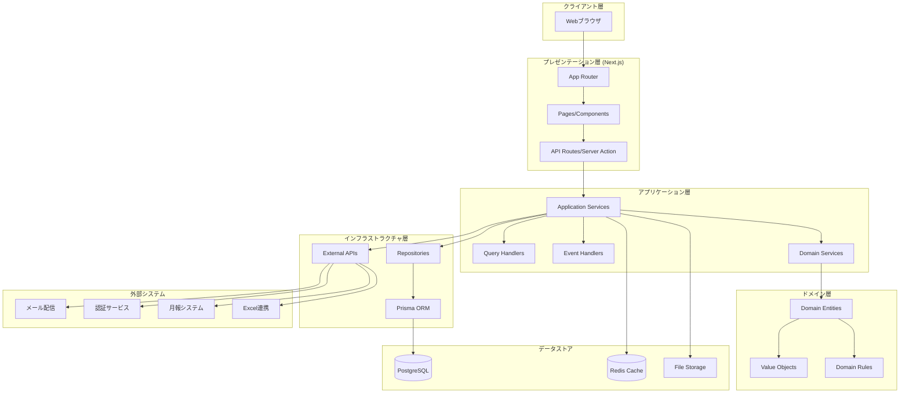

## 2. レイヤー アーキテクチャ（オニオンアーキテクチャ）

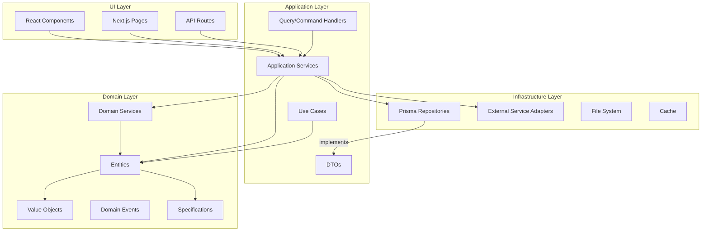

## 3. 主要コンポーネント関連図

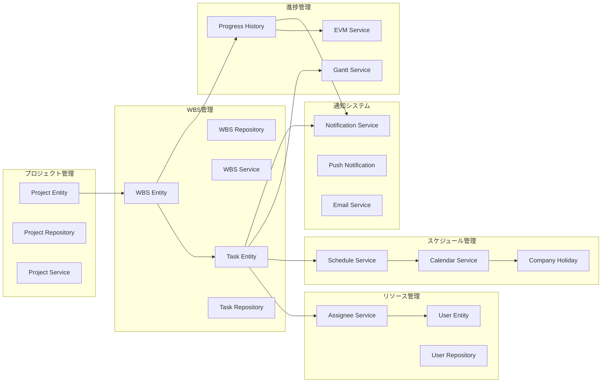

## 4. データフロー図

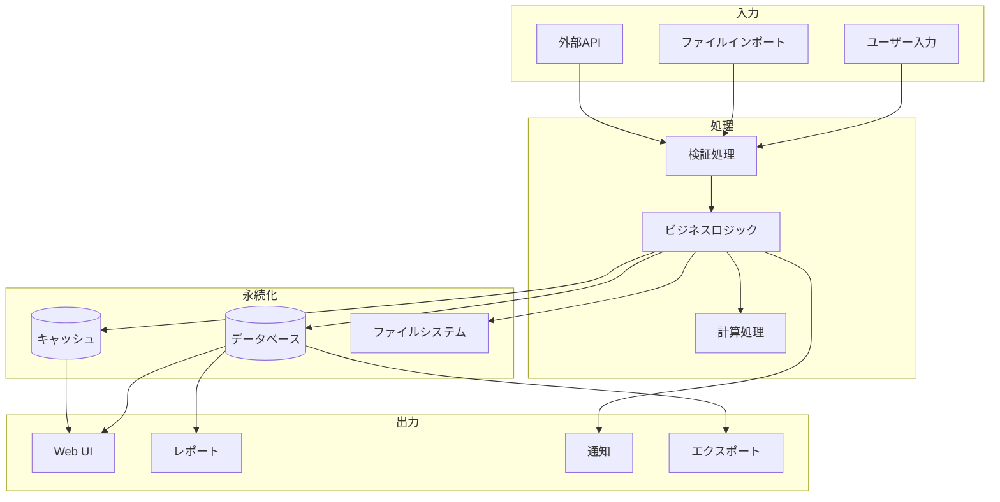

## 5. 認証・認可フロー

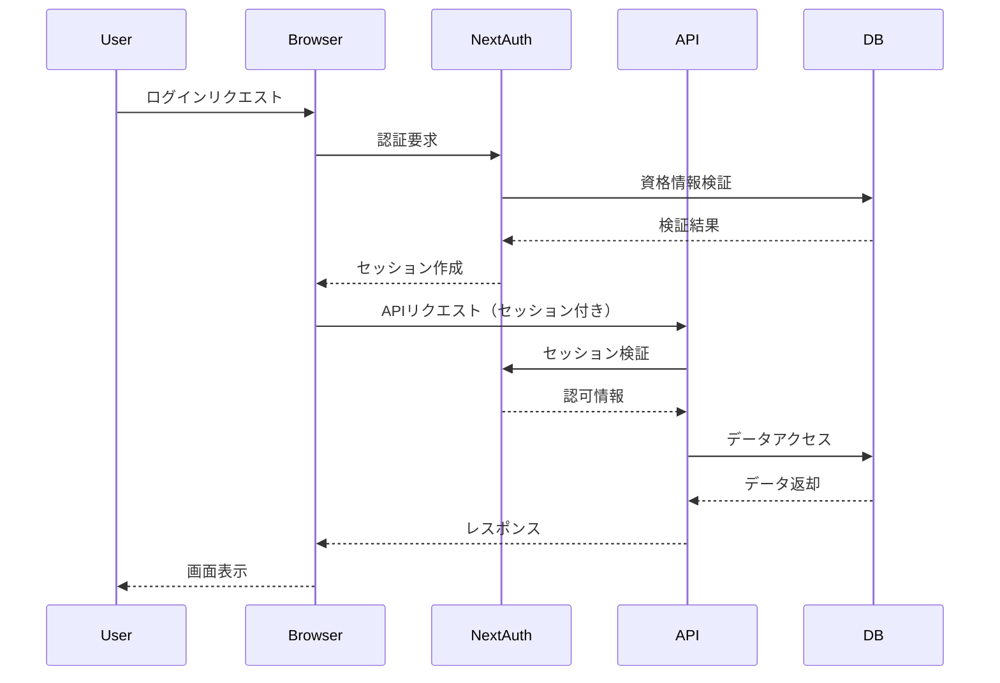

## 6. インポート処理フロー

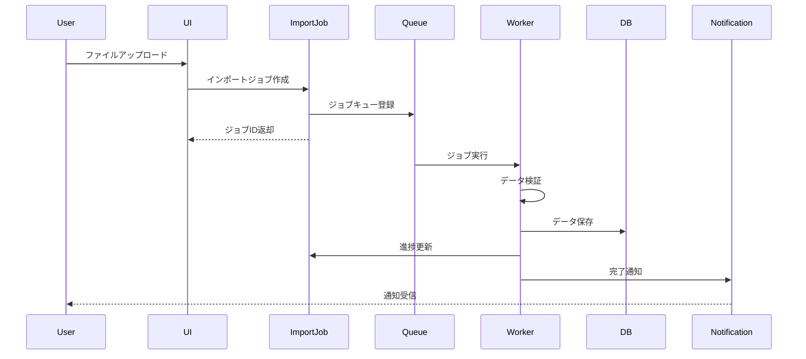

## 7. 依存性注入（DI）構成

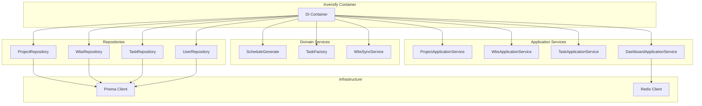

## 8. 主要機能の相関図

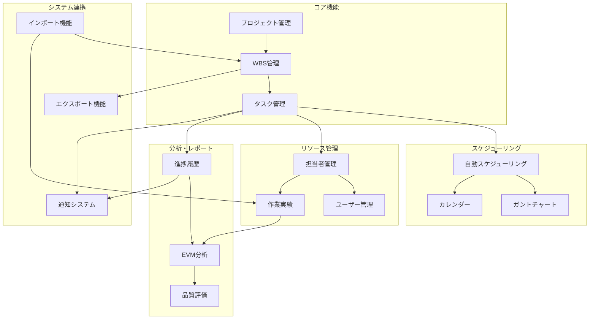

## 9. 技術スタック詳細

### フロントエンド
- **Framework**: Next.js 15 (App Router)
- **Language**: TypeScript
- **UI Library**: React 19
- **Component Library**: Radix UI
- **Styling**: Tailwind CSS
- **Form Management**: React Hook Form + Zod
- **State Management**: TanStack Query
- **Table**: TanStack Table

### バックエンド
- **Runtime**: Node.js
- **API**: Next.js API Routes
- **ORM**: Prisma
- **Database**: PostgreSQL / MySQL
- **DI Container**: Inversify

### インフラストラクチャ
- **Container**: Docker
- **Cache**: Redis (オプション)
- **File Storage**: ローカルファイルシステム
- **CI/CD**: GitHub Actions (想定)

### 開発ツール
- **Testing**: Jest, Playwright
- **Linting**: ESLint
- **Build Tool**: Turbopack
- **Package Manager**: npm

## 10. セキュリティアーキテクチャ

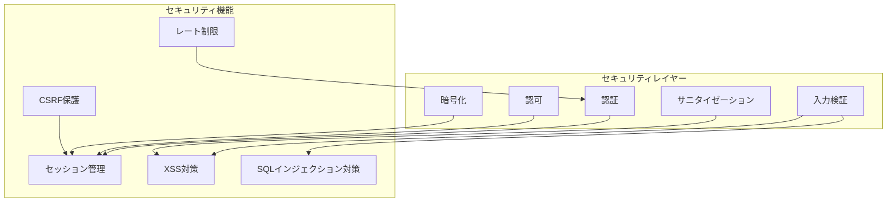

## 11. デプロイメント構成（想定）

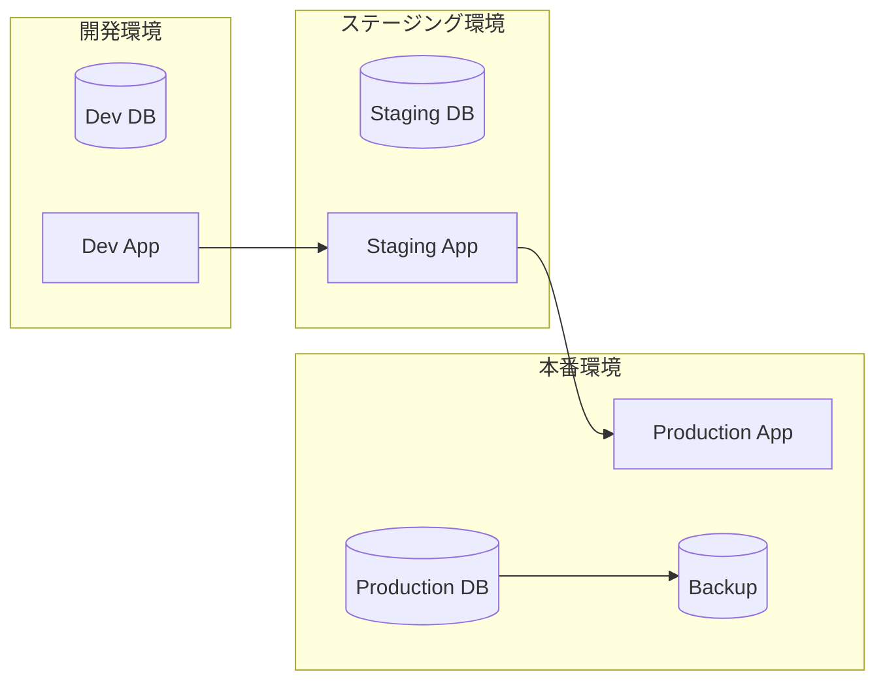

## 12. モニタリング・ログ構成

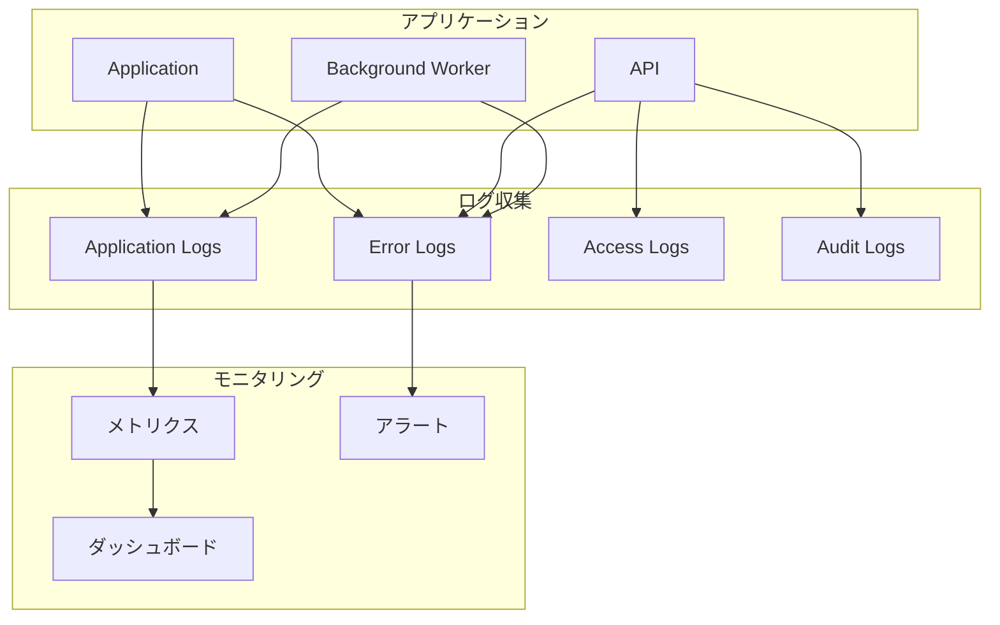