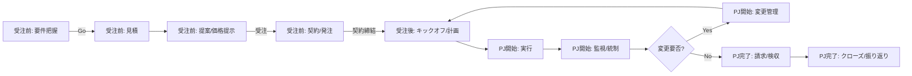

# 見積からプロジェクト管理までの標準フロー（ドラフト）

この文書は、商談・見積からプロジェクト完了までの標準フローを簡潔にまとめたたたきです。各フェーズの目的・主要アウトプット・ゲート（承認条件）・責任分担を定義し、本アプリの機能（WBS、ガント、実績、スケジュール生成 等）との対応を明確にします。

---

## 対象・前提
- 対象: 営業活動、受託/保守/社内プロジェクトのいずれにも適用可能な一般化フロー
- スコープ外：顧客発掘、採用活動、請求/入金管理

## 主要ロール
- Sales/Account: 商談・条件調整・契約窓口、見積作成
- PM: 計画策定、ベースライン確定、進捗/コスト/品質管理、変更/リスク統制
- TL: WBS分解、見積精度向上、チーム運営
- Member: 実装/テスト、実績入力、課題/リスク起票
- QA: 品質計画、レビュー/指標運用

## プロジェクト種別
- 受託プロジェクト
- 定常保守プロジェクト

## 大フェーズ
- 受注フェーズ
    - 要件把握
    - 見積
    - 提案/価格提示
    - 契約/発注
- [受託] 受注後/プロジェクト開始前
    - キックオフ/計画

- [定常] プロジェクト開始前
    - キックオフ/計画

- プロジェクト完了フェーズ
    - 請求/検収
    - クローズ/振り返り

## フェーズ一覧とアウトプット
| フェーズ | 目的 | 主要アウトプット | 承認ゲート |
|---|---|---|---|
| 0. [受注前] 要件把握 | 目的/要件把握、受注確度/方針判断 |  | 判定（商談継続可/不可） |
| 1. [受注前] 見積 | コスト/期間の算定 | 見積内訳（工数/外部費/バッファ）、想定スケジュール、見積書 | 見積承認（社内） |
| 2. [受注前] 提案/価格提示 | 顧客合意形成 | 提案書、見積書、価格・前提 | 顧客合意（発注内示） |
| 3. [受注前] 契約/発注 | 合意の法的確定 |  | 契約締結 |
| 4. [受注後] キックオフ/計画 | 実行可能な基準線の確立 | プロジェクト計画書(WBS 、ガント、体制表、品質/コミュ計画、リスク管理表) | 承認(社内) |
| 5. [PJ開始] 実行 | 成果物の作成 | 実装/テスト成果、作業実績、レポート | 完了判定/出荷判定 |
| 6. [PJ開始] 監視/統制 | 計画乖離の是正 | EVM指標、課題/リスクログ、是正計画 | KPI達成/閾値内 |
| 7. [PJ開始] 変更管理 | スコープ/コスト/納期の統制 | 変更要求票、影響分析、承認記録、BL更新 | CCB承認 |
| 8. [PJ完了] 請求/検収 | キャッシュフロー確保 | 請求書、検収書/受領書、計上記録 | 入金確認 |
| 9. [PJ完了] クローズ/振り返り | 終了処理と学習の定着 | 成果物引渡、棚卸、レトロ/Lessons Learned | 終了承認 |

## ハイレベルフロー（Mermaid）


## 役割別スイムレーン（簡易）
```mermaid
flowchart TB
  subgraph Sales [Sales]
    S0[機会/要件把握]
    S1[価格提示/条件調整]
    S2[契約締結手続]
  end
  subgraph PMTL [PM/TL]
    P0[見積(WBS/工数/バッファ)]
    P1[計画策定(WBS v1/ガント/体制)]
    P2[実行/進捗・品質管理]
    P3[変更管理/影響分析]
    P4[クローズ/レトロ]
  end
  subgraph Finance [Finance]
    F1[請求/入金管理]
  end
  S0 --> P0
  P0 --> S1
  S1 --> S2
  S2 --> P1
  P1 --> P2
  P2 --> P3
  P3 --> P2
  P2 --> F1
  F1 --> P4
```

---

## 各フェーズ詳細

### 0. 機会/要件把握（Go/No-Go）
- 入力: 顧客背景、課題、制約（期間/予算/品質/体制）
- 主な活動: ヒアリング、仮スコープ設定、除外項目明確化、初期リスク洗い出し
- 出力: 要件概要、仮スコープ&前提/除外、初期リスク一覧、概算スケジュール案
- ゲート: Go/No-Go（リスク受容可、収益性見込み、体制確保可）
- RACI: Sales(R), PM(A), TL/Council(C), Finance/I

### 1. 見積
- 方式: ボトムアップ（WBS×見積単価×稼働率）+ バッファ（不確実性/学習/外部要因）
- 内訳: 直接工数、外部費、環境/ツール費、予備費、利益、税
- 算式例: Cost = Σ(task工数×レート×係数) + 外部費 + 予備費
- 整合性: 期日→逆算、体制→稼働率/能力、範囲→曖昧度、既存資産再利用
- 出力: 見積内訳、価格案、想定マイルストーン、見積前提一覧
- ゲート: 社内承認（価格/条件/リスク）

### 2. 提案/価格提示
- 内容: スコープ境界、非範囲、受入条件、想定スケジュール、変更条項の方針
- 合意: 価格帯/段階的発注/マイルストーン検収の枠組み
- 出力: 提案書、議事録、アクションアイテム

### 3. 契約/発注
- 種別: 準委任/請負/チケット/混合
- 重要点: 検収基準、支払サイト、変更管理、責任範囲、知財、秘密保持、セキュリティ
- 出力: 契約書、個別注文書、検収/支払条件、連絡体制
- ゲート: 契約締結、PJ ID/請求先登録

### 4. キックオフ/計画
- 計画要素: WBS v1、タスク粒度、依存関係、マイルストーン、クリティカルパス
- リソース: 体制表、稼働率、スキルマップ、休暇/他案件との調整
- マネジメント計画: コミュニケーション、品質、リスク、変更、構成、E2Eテスト方針
- ベースライン: Scope/Schedule/CostのBL1確定（変更はCCB）
- 出力: 計画書一式、ベースライン記録

### 5. 実行
- 運用: デイリー/ウィークリー運営、バーンダウン、レビュー/デモ
- 実績: 作業実績記録、出来高、障害/欠陥ログ
- 可視化: ガント、ダッシュボード、負荷状況、KPI

### 6. 監視/統制
- 指標: EVM（PV/EV/AC、SPI/CPI）、進捗率、欠陥密度、ベロシティ
- 統制: 逸脱検知→是正計画→フォロー、リスクランク更新
- 出力: 週次/月次レポート、対策チケット

### 7. 変更管理（CCB）
- 流れ: 変更要求→影響分析（範囲/コスト/納期/品質）→承認→BL更新→計画再配分
- 出力: 変更要求票、影響分析、承認記録、更新後WBS/ガント

### 8. 請求/検収
- トリガ: 月次準委任/マイルストーン検収/出来高連動
- 必要物: 請求書、検収書、作業報告、受領確認
- Finance連携: 締め/送付/入金消込、未収/遅延対応

### 9. クローズ/振り返り
- 手順: 成果物引渡、アクセス/鍵の棚卸、ドキュメント整備、完了通知
- 学習: レトロ、Lessons Learned、再発防止アクション、テンプレ更新
- 出力: クローズ報告、ナレッジ蓄積

---

## 本アプリ機能との対応
- WBS・タスク管理: フェーズ4-7で中心活用（WBS作成、担当割当、ステータス、工数）
- ガント・可視化: フェーズ4-6で可視化/判断材料（マイルストーン、クリティカルパス）
- スケジュール自動生成: 計画初期のタスク展開や反復調整に活用
- 作業実績管理: フェーズ5-6の出来高/コスト統制、請求根拠
- 外部システム連携(Geppo): 実績参照/エクスポート、月次締め資料
- ダッシュボード/CQRS: KPI監視、予実・負荷の即時把握

## ミニマム運用チェックリスト
- [ ] 前提/除外/リスクを明文化し見積に反映した
- [ ] BL1（Scope/Schedule/Cost）を承認・記録した
- [ ] 実績入力の運用（頻度/責任）を合意した
- [ ] 変更要求票→CCB→BL更新の手順を定義した
- [ ] 請求トリガと締め日/証憑の流れを合意した
- [ ] クローズ後のナレッジ反映先（テンプレ/標準）を更新した

---

## 付録: テンプレひな型（メモ）
- 見積前提リスト: 前提/除外/リスク/バッファ根拠
- 変更要求票: 目的、差分、影響（QCDS）、判断、施行日
- 週次レポート: 進捗、予実、ハイライト/リスク、アクション
- レトロ: Keep/Problem/Try、オーナー/期限

> Note: これらは組織標準に合わせて適宜カスタマイズしてください。
