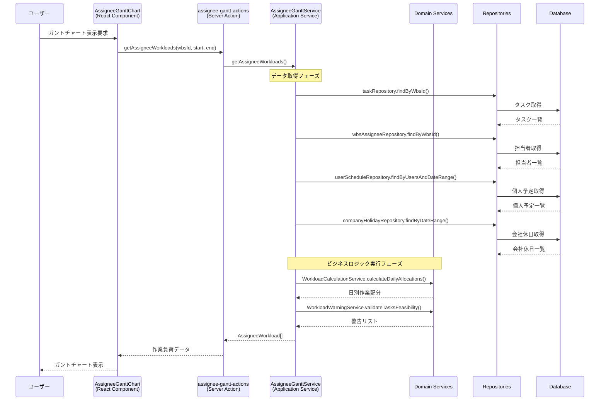
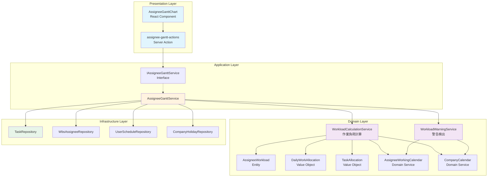

# 担当者ガントチャート機能

## 概要

担当者ガントチャート機能は、プロジェクトの各担当者の作業負荷を可視化し、リソース管理を支援するための機能です。タスクの工数を期間内の稼働可能時間に基づいて日別に配分し、過負荷状態や実現不可能なタスクを検出します。

### 主な機能
- 担当者別の日次作業負荷表示
- 稼働率の自動計算（個人予定・会社休日考慮）
- 過負荷状態の警告表示
- 実現不可能タスク（全日非稼働）の検出

## 画面からの処理フロー



## 依存サービスの関連図



## 各クラス・関数の処理内容

### 1. Server Action層
#### `assignee-gantt-actions.ts`

**getAssigneeWorkloads()**
- 役割: クライアントからのリクエストを受けてサービス層を呼び出す
- 処理内容:
  1. 日付文字列をDate型に変換
  2. DIコンテナからサービスインスタンスを取得
  3. サービス層のメソッドを呼び出し
  4. 結果をシリアライズ可能な形式に変換して返却

### 2. Application Service層
#### `AssigneeGanttService`

**getAssigneeWorkloads()**
- 役割: ユースケースのオーケストレーション
- 処理フロー:
  ```
  1. WBSに紐づくタスクと担当者情報を取得
  2. 会社休日と担当者の個人予定を取得
  3. 各担当者について:
     a. 担当者に割り当てられたタスクを抽出
     b. 担当者の個人予定を抽出
     c. ドメインサービスで作業負荷を計算
     d. AssigneeWorkloadエンティティを作成
  4. 担当者別の作業負荷配列を返す
  ```

**getAssigneeWarnings()**
- 役割: 実現不可能タスクの検出
- 処理内容:
  1. タスクと担当者情報を取得
  2. 会社休日を取得してカレンダー作成
  3. 各担当者の個人予定を取得
  4. ドメインサービスで警告を検出
  5. WorkloadWarning配列を返却

### 3. Domain Service層

#### `WorkloadCalculationService`

**calculateDailyAllocations()**
- 役割: 日別作業配分の計算
- アルゴリズム:
  ```typescript
  for each 日付 in 期間:
    1. AssigneeWorkingCalendarで稼働可能時間を計算
       - 会社休日チェック
       - 個人予定の控除
       - 稼働率の適用
    2. その日のアクティブタスクを抽出
    3. タスク工数を稼働可能時間比で按分
    4. DailyWorkAllocationを作成
  ```

**calculateTaskAllocationsForDate()**
- 役割: 特定日のタスク配分計算
- 計算式:
  ```
  配分工数 = タスク総工数 × (当日の稼働可能時間 / 期間内の総稼働可能時間)
  ```

**isTaskActiveOnDate()**
- 役割: タスクが特定日にアクティブか判定
- 判定条件: `予定開始日 <= 対象日 <= 予定終了日`

#### `WorkloadWarningService`

**validateTasksFeasibility()**
- 役割: 複数タスクの実現可能性を検証
- 警告条件: タスク期間内の稼働可能時間の総和が0

**validateTaskFeasibility()**
- 役割: 単一タスクの実現可能性を検証
- 処理:
  1. 担当者が割当済の場合: 個人予定も考慮した稼働時間で判定
  2. 未割当の場合: 会社休日のみで判定

### 4. Domain Entity/Value Object

#### `AssigneeWorkload` (Entity)
```typescript
{
  assigneeId: string        // 担当者ID
  assigneeName: string      // 担当者名
  dailyAllocations: []      // 日別作業配分
  overloadedDays: []        // 過負荷日リスト
  assigneeRate: number      // 稼働率
}
```

#### `DailyWorkAllocation` (Value Object)
```typescript
{
  date: Date                // 日付
  availableHours: number    // 稼働可能時間
  taskAllocations: []       // タスク配分
  allocatedHours: number    // 配分された工数
  isOverloaded: boolean     // 過負荷フラグ
  utilizationRate: number   // 稼働率
  overloadedHours: number   // 超過時間
  // ... その他のフィールド
}
```

#### `TaskAllocation` (Value Object)
```typescript
{
  taskId: string           // タスクID
  taskName: string         // タスク名
  allocatedHours: number   // 配分工数
  totalHours: number       // 総工数
  periodStart?: Date       // 開始日
  periodEnd?: Date         // 終了日
}
```

### 5. UI Component層

#### `AssigneeGanttChart` (React Component)

**主な機能:**
- 表示期間の切替（週/月）
- 日付ナビゲーション
- セルクリックで詳細表示
- 過負荷状態の色分け表示
- 警告メッセージ表示

**状態管理:**
```typescript
- workloads: AssigneeWorkload[]     // 作業負荷データ
- warnings: WorkloadWarning[]        // 警告リスト
- viewMode: 'week' | 'month'        // 表示モード
- currentDate: Date                  // 現在の表示期間
```

## 工数配分アルゴリズムの詳細

### 基本原則
タスクの総工数を、期間内の稼働可能時間の比率に基づいて日別に配分します。

### 計算例
```
タスク: 総工数40時間、期間5営業日
担当者の稼働率: 80%

期間内の稼働可能時間:
- 月曜: 7.5h × 0.8 = 6.0h
- 火曜: 7.5h × 0.8 = 6.0h (個人予定2h) → 4.0h
- 水曜: 7.5h × 0.8 = 6.0h
- 木曜: 会社休日 → 0h
- 金曜: 7.5h × 0.8 = 6.0h

総稼働可能時間 = 22.0h

日別配分:
- 月曜: 40h × (6.0h / 22.0h) = 10.9h
- 火曜: 40h × (4.0h / 22.0h) = 7.3h
- 水曜: 40h × (6.0h / 22.0h) = 10.9h
- 木曜: 40h × (0h / 22.0h) = 0h
- 金曜: 40h × (6.0h / 22.0h) = 10.9h
```

### 過負荷判定
- **通常過負荷**: 配分工数 > 稼働可能時間
- **標準超過**: 配分工数 > 標準勤務時間(7.5h)
- **レート超過**: 配分工数 > 稼働率による許容時間

## パフォーマンス考慮事項

1. **データ取得の最適化**
   - Promise.allによる並列データ取得
   - 必要な期間のみのデータ取得

2. **計算処理の効率化**
   - 日付範囲のループは1回のみ
   - 重複計算の回避（稼働可能時間のキャッシュ）

3. **UIレンダリング最適化**
   - 仮想スクロール対応可能な構造
   - メモ化による不要な再計算防止

## エラーハンドリング

1. **データ取得エラー**
   - Server Actionでtry-catchによるエラーハンドリング
   - エラーメッセージをUIに表示

2. **データ整合性チェック**
   - タスクの期間が未設定の場合はスキップ
   - 担当者が0人の場合は空配列を返却

3. **警告メカニズム**
   - 実現不可能タスクの自動検出
   - UIに警告メッセージ表示

## 拡張ポイント

1. **配分アルゴリズムのカスタマイズ**
   - WorkloadCalculationServiceの差し替えで配分ロジック変更可能
   - 優先度ベースの配分、平準化など

2. **警告条件の追加**
   - WorkloadWarningServiceに新しい検証ロジック追加
   - スキル不足、依存関係違反など

3. **表示形式の拡張**
   - 新しいViewModeの追加（日次、四半期など）
   - エクスポート機能の実装