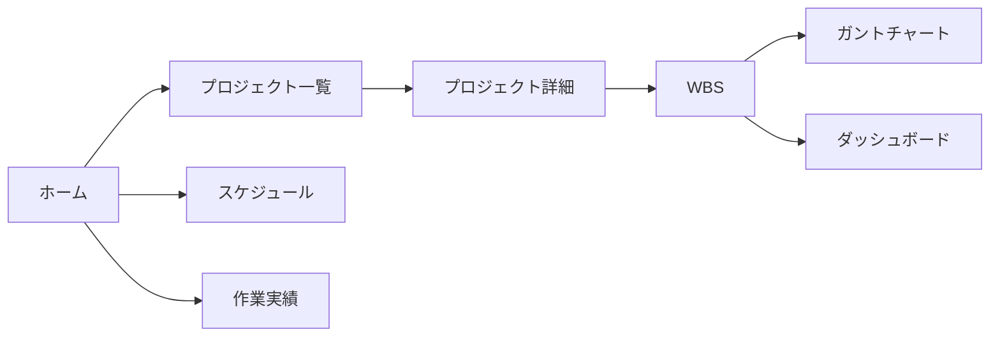

# ホーム画面

プロジェクト管理アプリのトップページです。ここから各機能へ遷移します。

## 主な機能

- **プロジェクト**: 進行中のプロジェクト一覧・新規作成
- **WBS**: プロジェクト配下のタスク構造を管理
- **スケジュール**: 個人の予定・アサイン状況の確認
- **作業実績**: 月次の工数記録

## 画面構成

## ヘッダーの操作

| 領域 | 内容 |
| --- | --- |
| 左側 | 現在画面のタイトル、プロジェクト名、工数サマリー |
| 右側 | ドキュメント、通知、アカウント |

ドキュメントボタン（本アイコン）は、ドキュメントが用意されている画面でのみ表示されます。
