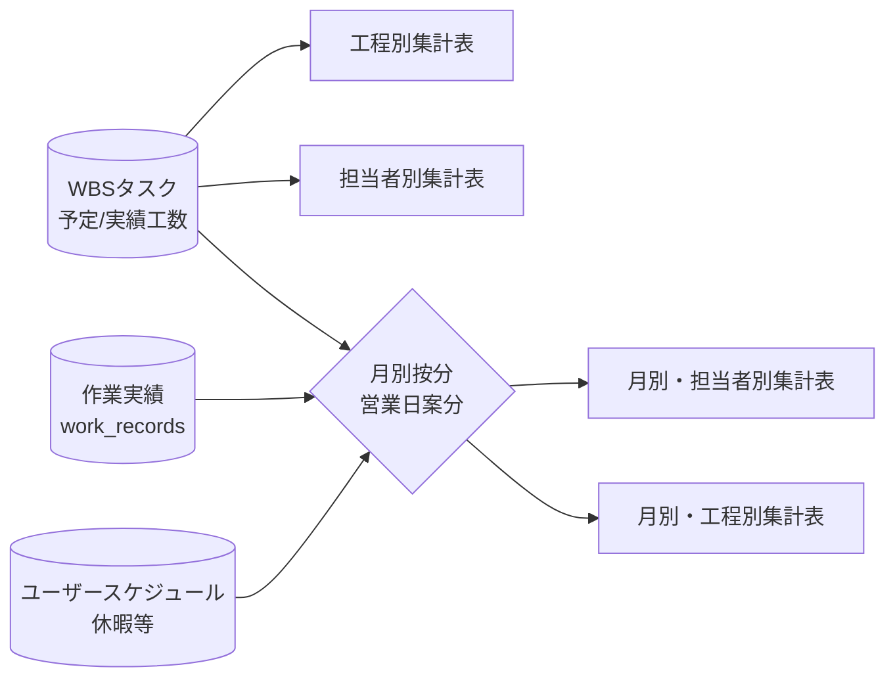

# プロジェクト詳細

プロジェクトの全体管理を行う画面です。上部のアクションボタンから工程・担当者・タスクの追加が、タブから各種ビュー（一覧／ガント／集計表など）の切替ができます。

## タブ構成

| アイコン | タブ | 内容 |
| --- | --- | --- |
| 概要 | summary | プロジェクト基本情報・全体サマリー |
| 一覧 | list | タスクのテーブル表示 |
| ガント | gantt | 期間ベースのガントチャート |
| マイルストーン | milestone | マイルストーンの追加・編集 |
| **集計表** | **table** | **工程別／担当者別／月別の工数集計（本ドキュメントの対象）** |
| 担当者ガント | assignee-gantt | 担当者別ガントチャート |
| EVM | evm | 出来高管理（EVM）ダッシュボード |
| 品質 | quality | 品質指標の集計 |
| 設定 | settings | プロジェクト設定 |

---

# 集計表タブ

集計表タブには **4つの表** が表示されます。すべての工数は右上のセレクトで「時間／人日／人月」に単位変更が可能です。

## 共通の用語

| 用語 | 意味 |
| --- | --- |
| **基準工数** | プロジェクト計画当初にタスクへ登録した工数。途中で見直す予定工数と区別するための「初期計画値」 |
| **予定工数** | 現時点でタスクに登録されている見積工数。再計画で更新される |
| **実績工数** | 実際に作業した工数。担当者が登録した作業実績（work_records）から集計 |
| **見通し工数** | 進捗状況から算出される「最終的にかかると見込まれる総工数」。後述の「見通し算出方式」で計算ロジックが決まる |
| **差分** | 「実績工数 − 予定工数」。赤=超過／緑=ぴったり／青=予定内 |

---

## 1. 工程別集計表

工程（要件定義・設計・実装 …）ごとに、タスク数と工数を横並びで比較できる表です。

### 列の意味

| 列 | 算出方法 |
| --- | --- |
| 工程 | プロジェクトに登録された工程名（順序は工程の `seq` に従う） |
| タスク数 | その工程に紐づくタスクの件数 |
| 予定工数 | その工程に属する全タスクの **予定工数の合計** |
| 実績工数 | その工程に属する全タスクの **実績工数の合計** |
| 差分 | `実績工数 − 予定工数` |

最終行の「合計」は全工程の単純合計です。

> **使いどころ**: 工程別に予定と実績の乖離を見て、見積精度の弱い工程を把握する。

---

## 2. 担当者別集計表

担当者ごとに、タスク数と工数を比較できる表です。

### 列の意味

| 列 | 算出方法 |
| --- | --- |
| 担当者 | タスクに割り当てられた担当者名。担当者未設定のタスクは「未割当」にまとめられる |
| タスク数 | その担当者が持つタスク件数 |
| 予定工数 | その担当者の全タスクの **予定工数の合計** |
| 実績工数 | その担当者の全タスクの **実績工数の合計** |
| 差分 | `実績工数 − 予定工数` |

> **使いどころ**: 担当者ごとの負荷バランスや見積精度を確認する。

---

## 3. 月別・担当者別集計表

月 × 担当者のマトリクスで、各月の工数推移を確認する表です。月毎に **基準／予定／実績／見通し／差分** の最大5系統が表示されます（右上のチェックボックスで「差分」「基準」「見通し」の表示切替が可能）。

### 月別のセル値の算出方法

タスクの予定工数を、**予定開始日〜予定終了日の営業日数で按分**して各月に振り分けます。

例: 予定工数 40h・期間が 1/29〜2/5（営業日 6日分）の場合
- 1月分: 40h × (1月の該当営業日数 ÷ 6営業日)
- 2月分: 40h × (2月の該当営業日数 ÷ 6営業日)

担当者のスケジュール（休暇・他作業）が登録されていれば、その日は稼働可能時間から除外されます。プロジェクト設定で「0.25時間単位に丸める」が ON なら、各月への配分後に量子化されます。

### 各列の算出方法

| 列 | 算出方法 |
| --- | --- |
| 基準工数 | タスクの **基準工数** を営業日数で月別に按分した値 |
| 予定工数 | タスクの **予定工数** を営業日数で月別に按分した値 |
| 実績工数 | **作業実績（work_records）の登録月** で集計。「実際に作業した月」「実際に作業した人」で計上される（タスクの担当者と異なる人が代行した場合、その代行者の行に計上される） |
| 見通し工数 | 後述の「見通し算出方式」でタスク単位の総見通し工数を算出し、月別予定工数と実績工数の比率で月に分配 |
| 差分 | `実績工数 − 予定工数`（月毎・担当者毎） |

### 見通し工数の算出方式

プロジェクト設定の **見通し算出方式** で切り替わります。

| 方式 | 算出ロジック |
| --- | --- |
| 現実的 (realistic / 既定) | 進捗率に基づき残工数を実績ペースで補正 |
| 楽観的 (optimistic) | 残工数を予定工数ベースで小さめに見積もる |
| 悲観的 (conservative) | 残工数を実績ペースで大きめに見積もる |
| 予定 or 実績 (plannedOrActual) | 予定と実績の大きい方を採用 |

進捗率の計算には **進捗測定方式** が使われます（0/100法・50/50法・自己申告進捗率）。

### 行・列の合計

- **担当者ごとの合計列**: その担当者の全月合計
- **月ごとの合計行**: その月の全担当者合計
- **総合計**: 全担当者・全月の合計

---

## 4. 月別・工程別集計表

月 × 工程のマトリクスで、各工程が各月にどれだけ進むかを確認する表です。表示切替や月別配分のロジックは「月別・担当者別集計表」と同じです。違いは **集計軸が「担当者」ではなく「工程」** という点だけです。

> **使いどころ**: 工程ごとの月次進捗を追跡し、計画通りに進んでいるかを確認する。

---

## エクスポート機能

各表の右上から、以下の操作が可能です。

- **コピー**: TSV 形式でクリップボードにコピー（Excel に直接ペースト可能）
- **出力**: CSV / TSV ファイルとしてダウンロード

選択中の工数単位（時間／人日／人月）が、出力データにも反映されます。

## データソース

## 注意点

- 担当者別・月別の実績は **geppo（月報）の登録月** が基準です。geppo が正データのため、過去月の再インポートで値が変わるのは正常動作です
- **過去月の集計値は締め処理（確定ロック）されていません**。geppo 側で過去月の修正・再提出があれば、次回インポート時にそのまま集計へ反映されます
- 「見通し」「基準」「差分」は表示切替が可能ですが、**月別・担当者別と月別・工程別の表示状態は連動** します（一方を非表示にすると両方非表示になる）
- 「未割当」は担当者が設定されていないタスク、「未設定」は工程が設定されていないタスクをまとめた行です
