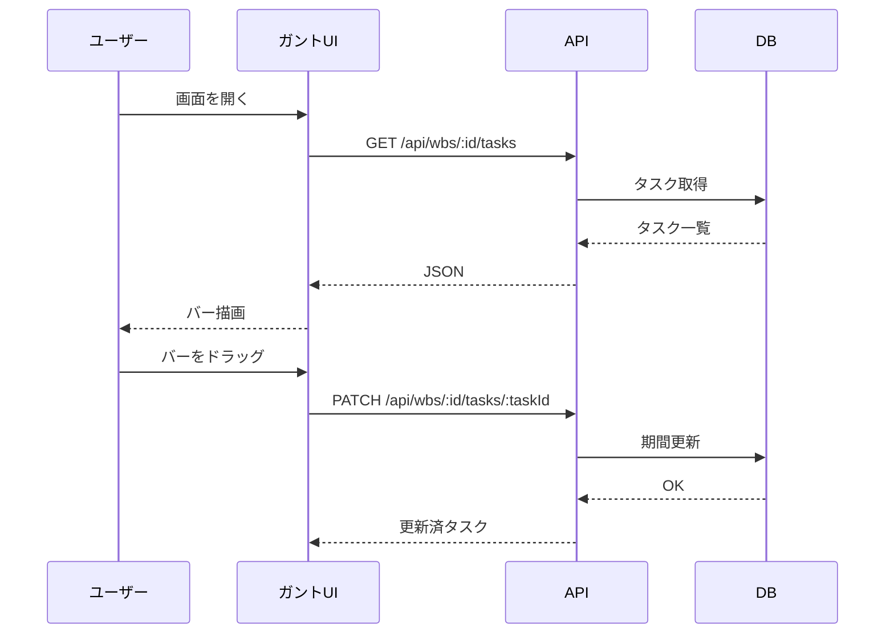

# ガントチャート（WBS）

WBS に紐づくタスクを時系列で可視化する画面です。

## 主な操作

- **期間変更**: 上部のコントロールで表示期間（日/週/月）を切り替え
- **タスクバー編集**: バーをドラッグして期間変更、端を掴んで伸縮
- **依存関係**: タスク間の前後関係を線で表示
- **フィルタ**: 担当者・フェーズで絞り込み可能

## データの流れ

## 注意点

- 日付は **UTC で保存** され、ブラウザのタイムゾーンで表示されます
- 長期間の表示ではパフォーマンス低下を避けるため、表示粒度は自動で調整されます
- 依存関係のループは登録できません（循環検証あり）
