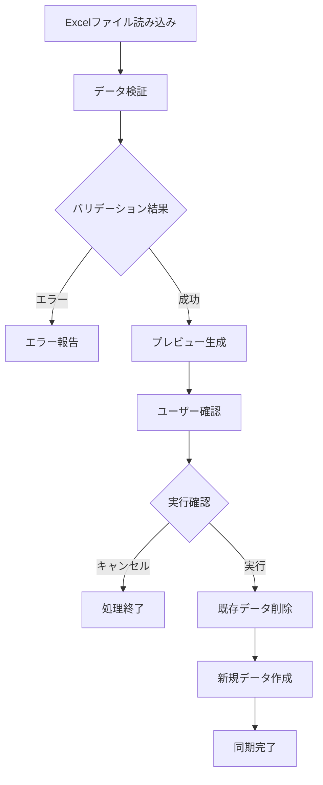
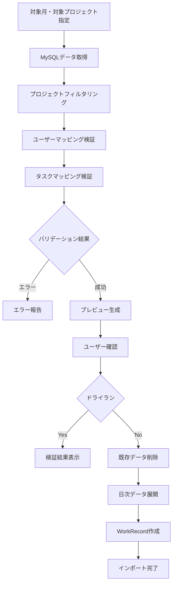

# MySQLインポート機能マッピング仕様

## 概要

このドキュメントは、MySQLの`wbs`テーブルと`geppo`テーブルから本システムへのデータインポート機能におけるフィールドマッピング仕様を定義します。

## 1. WBSテーブルインポート仕様

### 1.1 概要
- **ソース**: MySQL `wbs` テーブル（Excelファイルから事前にインポートされたデータ）
- **ターゲット**: PostgreSQL `wbs_task` テーブル
- **インポート方式**: MySQLテーブル経由での同期
- **処理単位**: WBS単位での一括処理

### 1.2 フィールドマッピング

| MySQLフィールド | PostgreSQLフィールド | データ型変換 | 必須 | 備考 |
|----------------|---------------------|-------------|------|------|
| `WBS_ID` | `taskNo` | VARCHAR → TaskNo | ✓ | タスク番号 |
| `TASK` または `ACTIVITY` | `name` | VARCHAR → STRING | ✓ | タスク名（TASKが優先） |
| `PHASE` | `phaseId` | VARCHAR → INT | ✓ | フェーズ名からIDへ変換 |
| `TANTO` | `assigneeId` | VARCHAR → INT | | 担当者名からIDへ変換 |
| `STATUS` | `status` | VARCHAR → TaskStatus | | ステータス変換 |
| `ROW_NO` | - | INT → - | | Excel行番号（エラー参照用） |

### 1.3 期間データマッピング

#### 基準日程（KIJUN）
| MySQLフィールド | PostgreSQLフィールド | 期間タイプ | 備考 |
|----------------|---------------------|-----------|------|
| `KIJUN_START_DATE` | `periods.startDate` | KIJUN | 基準開始日 |
| `KIJUN_END_DATE` | `periods.endDate` | KIJUN | 基準終了日 |
| `KIJUN_KOSU` | `kosus.kosu` | NORMAL | 通常工数 |
| `KIJUN_KOSU_BUFFER` | `kosus.kosu` | RISK | リスク工数 |

#### 予定日程（YOTEI）
| MySQLフィールド | PostgreSQLフィールド | 期間タイプ | 備考 |
|----------------|---------------------|-----------|------|
| `YOTEI_START_DATE` | `periods.startDate` | YOTEI | 予定開始日 |
| `YOTEI_END_DATE` | `periods.endDate` | YOTEI | 予定終了日 |
| `YOTEI_KOSU` | `kosus.kosu` | NORMAL | 予定工数 |

#### 実績日程（JISSEKI）
| MySQLフィールド | PostgreSQLフィールド | 期間タイプ | 備考 |
|----------------|---------------------|-----------|------|
| `JISSEKI_START_DATE` | `periods.startDate` | JISSEKI | 実績開始日 |
| `JISSEKI_END_DATE` | `periods.endDate` | JISSEKI | 実績終了日 |

### 1.4 データ変換ルール

#### ステータス変換
```typescript
const statusMapping = {
  '未着手': 'NOT_STARTED',
  '着手中': 'IN_PROGRESS',
  '完了': 'COMPLETED'
}
// デフォルト: 'NOT_STARTED'
```

#### フェーズマッピング
1. 既存フェーズ検索: `PHASE`名でWBS内のフェーズを検索
2. 新規フェーズ作成時:
   - **コード生成**: `WBS_ID`のハイフン前部分（例: "A-001" → "A"）
   - **シーケンス**: フェーズコードの昇順で自動採番

#### 担当者マッピング
1. 既存担当者検索: `TANTO`名でWBS内の担当者を検索
2. 新規担当者作成時:
   - **ユーザー作成**: 
     - displayName = TANTO
     - email = TANTO@example.com
   - **WbsAssignee作成**:
     - rate = 100（参画率100%）
     - seq = 自動採番

### 1.5 バリデーションルール

1. **必須フィールドチェック**
   - `WBS_ID`（タスク番号）: 必須
   - `TASK`または`ACTIVITY`（タスク名）: いずれか必須
   - `PHASE`（フェーズ）: 必須

2. **日付妥当性チェック**
   - 開始日 ≤ 終了日
   - 無効な日付形式はエラー

3. **エラー情報**
   - `ROW_NO`を使用してExcel行番号を特定
   - 詳細なバリデーションエラーメッセージ

## 2. Geppoテーブルインポート仕様

### 2.1 概要
- **ソース**: MySQL `geppo` テーブル
- **ターゲット**: PostgreSQL `work_records` テーブル
- **インポート方式**: 直接データベース連携
- **更新モード**: マージまたは置換

### 2.2 フィールドマッピング

| MySQLフィールド | PostgreSQLフィールド | データ型変換 | 必須 | 備考 |
|----------------|---------------------|-------------|------|------|
| `MEMBER_ID` | `userId` | VARCHAR(15) → STRING | ✓ | メンバーIDからユーザーIDへの変換 |
| `PROJECT_ID` | - | VARCHAR(50) → - | | プロジェクトフィルタリング用 |
| `WBS_NO` | `taskId` | VARCHAR(20) → INT | | タスク番号からタスクIDへの変換 |
| `GEPPO_YYYYMM` | `date` | VARCHAR(6) → DATE | ✓ | 年月（YYYYMM）から日付への展開 |
| `DAY01`〜`DAY31` | `hours_worked` | DOUBLE → DECIMAL | ✓ | 日次工数データ（0.0〜24.0） |
| `MEMBER_NAME` | - | VARCHAR(20) → - | | 参照情報（マッピングには不使用） |
| `PROJECT_SUB_ID` | - | VARCHAR(20) → - | | サブプロジェクト情報 |
| `WBS_NAME` | - | VARCHAR(100) → - | | タスク名（参照情報） |
| `WORK_NAME` | - | VARCHAR(100) → - | | 作業内容（参照情報） |
| `TOTAL` | - | DOUBLE → - | | 月次合計工数（検証用） |

### 2.3 データ変換ルール

#### ユーザーマッピング
```typescript
// UserMappingService.tsの実装
const matchedUser = existingUsers.find(u =>
  u.id === memberId ||                   // 完全一致
  u.email.startsWith(memberId)           // メールアドレスプレフィックス一致
)
```
- `MEMBER_ID`と`users.id`の完全一致を優先
- 一致しない場合は`users.email`の先頭部分とマッチング（例："emp001@company.com"の場合、"emp001"でマッチ）

#### プロジェクトフィルタリング
```typescript
// ProjectMappingService.tsの実装
const matchedProject = existingProjects.find(p =>
  p.name === geppoProjectId ||           // 完全一致
  p.name.includes(geppoProjectId) ||     // 部分一致
  geppoProjectId.includes(p.name)        // 逆部分一致
)
```
- プロジェクト名による柔軟なマッチング戦略
- 対象プロジェクトが指定された場合のみフィルタリング実行

#### タスクマッピング
```typescript
// TaskMappingService.tsの実装
const matchedTask = existingTasks.find(t =>
  t.taskNo.getValue() === wbsNo         // WBS_NOとtaskNoの完全一致
)
```
- `geppo.WBS_NO`と`wbs_tasks.taskNo`の完全一致でマッピング
- マッピングできない場合は警告を出力し、該当レコードをスキップ

#### 日次データ展開
```typescript
// 年月（YYYYMM）から各日の作業実績を展開
for (let day = 1; day <= 31; day++) {
  const dayField = `DAY${day.toString().padStart(2, '0')}` as keyof Geppo;
  const hoursWorked = geppoRecord[dayField] as number;
  
  if (hoursWorked && hoursWorked > 0) {
    const year = parseInt(geppoRecord.GEPPO_YYYYMM.substring(0, 4));
    const month = parseInt(geppoRecord.GEPPO_YYYYMM.substring(4, 6));
    const workDate = new Date(year, month - 1, day);
    
    // 日付妥当性チェック（月末日を超える場合はスキップ）
    if (workDate.getMonth() === month - 1) {
      // work_recordsレコード作成
      await workRecordRepository.create({
        userId: mappedUserId,
        projectId: mappedProjectId,
        taskId: mappedTaskId,
        date: workDate,
        hours_worked: hoursWorked,
        description: geppoRecord.WORK_NAME || ''
      });
    }
  }
}
```

### 2.4 バリデーションルール

1. **必須フィールドチェック**
   - `MEMBER_ID`：必須（VARCHAR(15)）
   - `GEPPO_YYYYMM`：必須（6文字のYYYYMM形式）
   - `ROW_NO`：必須（プライマリキーの一部）

2. **マッピングチェック**
   - ユーザーマッピング：`MEMBER_ID`が既存ユーザーにマッピング可能か検証
     - マッピング率を計算し、低い場合は警告
   - プロジェクトマッピング：`PROJECT_ID`でのフィルタリング（オプション）
     - 対象プロジェクトが指定された場合のみ検証
   - タスクマッピング：`WBS_NO`が既存タスクに対応するか検証
     - マッピングできない場合は該当レコードをスキップ

3. **日付妥当性チェック**
   - `GEPPO_YYYYMM`：YYYYMM形式（例："202304"）
   - 日次データ展開時の月末日チェック
     - 2月30日、4月31日などの無効な日付をスキップ

4. **工数データチェック**
   - 日次工数（`DAY01`〜`DAY31`）：0.0以上24.0以下のDOUBLE型
   - 月次合計（`TOTAL`）との整合性確認（警告のみ）
   - NULL値は0として扱う

5. **インポートモード**
   - **置換モード**：対象月・対象ユーザーの既存データを削除してから新規作成
   - **マージモード**：既存データと重複しない日付のみ追加（現在未実装）

## 3. インポートプロセス

### 3.1 WBSインポートフロー



### 3.2 Geppoインポートフロー



## 4. エラーハンドリング

### 4.1 エラー分類

#### システムエラー
- データベース接続エラー
- ファイル読み込みエラー
- メモリ不足

#### データエラー
- 必須フィールド欠如
- データ型不整合
- 参照整合性エラー

#### ビジネスルールエラー
- 重複データ
- 無効な値
- マッピング不可能なデータ

### 4.2 エラー処理方針

1. **継続可能エラー**: ログに記録し、処理を継続
2. **致命的エラー**: 処理を中断し、ロールバック
3. **警告**: ユーザーに通知し、確認を求める

## 5. 性能要件

### 5.1 処理性能目標

- **WBSインポート**: 1,000タスク/分
- **Geppoインポート**: 10,000レコード/分
  - 1レコードあたり最大31個のWorkRecord生成
  - バッチ処理による効率化
- **メモリ使用量**: 512MB以下
- **タイムアウト**: 30分

### 5.2 大容量データ対応

1. **バッチ処理**: 1,000件単位での分割処理
2. **進捗表示**: リアルタイム進捗更新
3. **非同期実行**: バックグラウンド処理
4. **キャンセル機能**: ユーザーによる処理中断

## 6. セキュリティ考慮事項

1. **データ暗号化**: 転送中および保存時の暗号化
2. **アクセス制御**: 適切な権限チェック
3. **監査ログ**: インポート操作の記録
4. **データマスキング**: 個人情報の適切な取り扱い

## 7. 運用考慮事項

### 7.1 バックアップ・リストア

- インポート前の自動バックアップ
- 失敗時の自動ロールバック
- 手動リストア機能

### 7.2 モニタリング

- インポート処理状況の監視
- エラー発生時のアラート
- 性能メトリクスの収集

### 7.3 メンテナンス

- 定期的なマッピングテーブル更新
- パフォーマンスチューニング
- ログファイルのローテーション

## 8. テスト仕様

### 8.1 単体テスト

- 各マッピング関数の動作確認
- バリデーション機能の確認
- エラーハンドリングの確認

### 8.2 統合テスト

- エンドツーエンドのインポート処理
- 大容量データでの性能テスト
- 異常系シナリオのテスト

### 8.3 受け入れテスト

- 実際のデータを使用したテスト
- ユーザビリティテスト
- 性能要件の確認

---

## 付録

### A. サンプルデータ

#### WBS Excelファイル形式
```
ROW_NO | WBS_ID | PHASE | TASK | ACTIVITY | TANTO | STATUS | KIJUN_START_DATE | KIJUN_END_DATE | KIJUN_KOSU
1      | A-001  | 要件定義 | 要件調査 | | 田中太郎 | 未着手 | 2023-04-01 | 2023-04-05 | 40
```

#### Geppoテーブル形式
```sql
MEMBER_ID | GEPPO_YYYYMM | ROW_NO | PROJECT_ID | WBS_NO | WORK_NAME | DAY01 | DAY02 | ... | DAY31 | TOTAL
emp001    | 202304       | 1      | PJ001      | A-001  | 設計作業   | 8.0   | 8.0   | ... | 0.0   | 176.0
```

### B. 実装ファイル参照

#### 主要な実装ファイル

1. **Geppoインポートサービス**
   - `/src/infrastructures/geppo-import/geppo-import.service.ts`
   - メインのインポート処理実装

2. **マッピングサービス**
   - `/src/infrastructures/geppo-import/user-mapping.service.ts`
   - `/src/infrastructures/geppo-import/project-mapping.service.ts`
   - `/src/infrastructures/geppo-import/task-mapping.service.ts`

3. **データベース定義**
   - `/mysql/init/create-geppo-table.sql`
   - MySQLのgeppoテーブル定義

4. **ステータスマッピング定数**
   ```typescript
   // WBSインポートのステータスマッピング
   const statusMapping = {
     '未着手': 'NOT_STARTED',
     '着手中': 'IN_PROGRESS', 
     '完了': 'COMPLETED'
   }
   ```