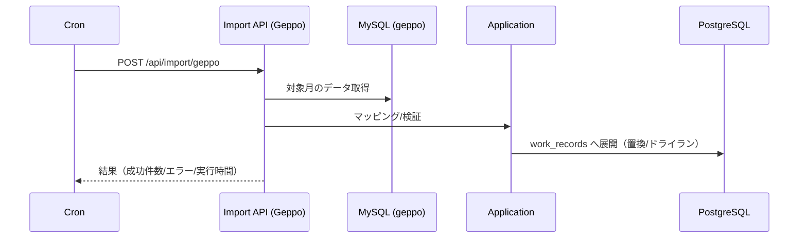
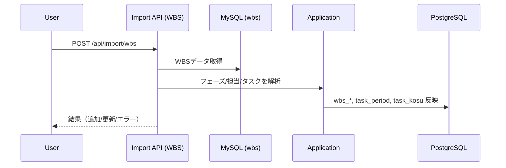
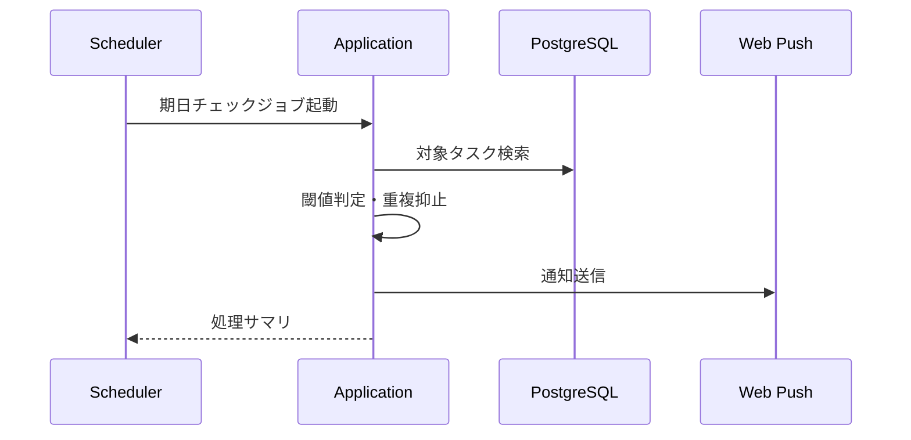

# 主要シーケンス

主要ユースケースの流れを示します。Mermaidで概略を示し、詳細は各仕様参照。

## Geppo実績インポート

```mermaid
sequenceDiagram
  participant Cron
  participant API as Import API (Geppo)
  participant MySQL as MySQL (geppo)
  participant App as Application
  participant PG as PostgreSQL

  Cron->>API: POST /api/import/geppo
  API->>MySQL: 対象月のデータ取得
  API->>App: マッピング/検証
  App->>PG: work_records へ展開（置換/ドライラン）
  API-->>Cron: 結果（成功件数/エラー/実行時間）
```

## WBS同期

```mermaid
sequenceDiagram
  participant User
  participant API as Import API (WBS)
  participant MySQL as MySQL (wbs)
  participant App as Application
  participant PG as PostgreSQL

  User->>API: POST /api/import/wbs
  API->>MySQL: WBSデータ取得
  API->>App: フェーズ/担当/タスクを解析
  App->>PG: wbs_*, task_period, task_kosu 反映
  API-->>User: 結果（追加/更新/エラー）
```

## 通知（期日超過の例）

```mermaid
sequenceDiagram
  participant Scheduler
  participant App as Application
  participant PG as PostgreSQL
  participant Push as Web Push

  Scheduler->>App: 期日チェックジョブ起動
  App->>PG: 対象タスク検索
  App->>App: 閾値判定・重複抑止
  App->>Push: 通知送信
  App-->>Scheduler: 処理サマリ
```