# プロジェクト管理システム ユースケース図

## ユースケース図（PlantUML）

```plantuml
@startuml project-management-use-cases
!theme cerulean

title プロジェクト管理システム ユースケース図

' アクター定義
actor "管理者\n(Administrator)" as Admin
actor "プロジェクトマネージャー\n(Project Manager)" as PM
actor "チームリーダー\n(Team Leader)" as TeamLeader
actor "プロジェクトメンバー\n(Project Member)" as Member
actor "品質管理担当者\n(QA)" as QA
actor "開発者・テスター\n(Developer/Tester)" as Dev
actor "外部システム\n(External System)" as External

' パッケージ定義
package "認証・ユーザー管理" {
  usecase "ユーザーログイン" as UC_Login
  usecase "ユーザー登録" as UC_Register
  usecase "ログアウト" as UC_Logout
  usecase "ユーザー一覧表示" as UC_UserList
  usecase "ユーザー詳細表示" as UC_UserDetail
  usecase "ユーザー作成" as UC_UserCreate
  usecase "ユーザー編集" as UC_UserEdit
}

package "プロジェクト管理" {
  usecase "プロジェクト一覧表示" as UC_ProjectList
  usecase "プロジェクト詳細表示" as UC_ProjectDetail
  usecase "プロジェクト作成" as UC_ProjectCreate
  usecase "プロジェクト編集" as UC_ProjectEdit
  usecase "プロジェクトステータス管理" as UC_ProjectStatus
}

package "WBS・タスク管理" {
  usecase "WBS作成・編集" as UC_WBSManage
  usecase "タスク作成・編集・削除" as UC_TaskManage
  usecase "タスクステータス管理" as UC_TaskStatus
  usecase "タスク担当者アサイン" as UC_TaskAssign
  usecase "タスク工数管理" as UC_TaskEffort
  usecase "タスクテーブル表示" as UC_TaskTable
  usecase "フェーズ管理" as UC_PhaseManage
  usecase "WBS担当者管理" as UC_WBSAssignee
}

package "ガントチャート・可視化" {
  usecase "ガントチャート表示" as UC_GanttView
  usecase "マイルストーン表示" as UC_MilestoneView
  usecase "プロジェクトダッシュボード" as UC_Dashboard
  usecase "プロジェクト統計表示" as UC_Stats
}

package "スケジュール管理" {
  usecase "ユーザースケジュール表示" as UC_ScheduleView
  usecase "スケジュール追加・インポート" as UC_ScheduleImport
  usecase "予定自動生成" as UC_ScheduleGenerate
}

package "作業実績管理" {
  usecase "作業実績一覧表示" as UC_WorkRecordList
  usecase "作業実績入力" as UC_WorkRecordInput
  usecase "作業実績インポート" as UC_WorkRecordImport
}

package "外部システム連携" {
  usecase "Geppo月報データ検索" as UC_GeppoSearch
  usecase "Geppo作業実績表示" as UC_GeppoDisplay
  usecase "Geppo CSVエクスポート" as UC_GeppoExport
}

package "品質管理" {
  usecase "定量品質評価" as UC_QualityAssessment
}

package "テスト・デバッグ" {
  usecase "ガントチャートテスト" as UC_GanttTest
  usecase "スクリーンショットテスト" as UC_ScreenshotTest
}

' アクターとユースケースの関係

' 全員が使える機能
Admin --> UC_Login
PM --> UC_Login
TeamLeader --> UC_Login
Member --> UC_Login
QA --> UC_Login
Dev --> UC_Login

Admin --> UC_Logout
PM --> UC_Logout
TeamLeader --> UC_Logout
Member --> UC_Logout
QA --> UC_Logout
Dev --> UC_Logout

' 管理者の機能
Admin --> UC_Register
Admin --> UC_UserList
Admin --> UC_UserDetail
Admin --> UC_UserCreate
Admin --> UC_UserEdit
Admin --> UC_GeppoSearch
Admin --> UC_GeppoDisplay
Admin --> UC_GeppoExport

' プロジェクトマネージャーの機能
PM --> UC_ProjectList
PM --> UC_ProjectDetail
PM --> UC_ProjectCreate
PM --> UC_ProjectEdit
PM --> UC_ProjectStatus
PM --> UC_WBSManage
PM --> UC_TaskManage
PM --> UC_TaskStatus
PM --> UC_TaskAssign
PM --> UC_TaskEffort
PM --> UC_PhaseManage
PM --> UC_WBSAssignee
PM --> UC_ScheduleGenerate
PM --> UC_QualityAssessment
PM --> UC_GeppoSearch
PM --> UC_GeppoDisplay
PM --> UC_GeppoExport

' チームリーダーの機能
TeamLeader --> UC_ProjectList
TeamLeader --> UC_ProjectDetail
TeamLeader --> UC_WBSManage
TeamLeader --> UC_TaskManage
TeamLeader --> UC_TaskStatus
TeamLeader --> UC_TaskAssign
TeamLeader --> UC_WBSAssignee

' 全てのプロジェクトメンバーが使える機能
Admin --> UC_GanttView
PM --> UC_GanttView
TeamLeader --> UC_GanttView
Member --> UC_GanttView
QA --> UC_GanttView

Admin --> UC_MilestoneView
PM --> UC_MilestoneView
TeamLeader --> UC_MilestoneView
Member --> UC_MilestoneView
QA --> UC_MilestoneView

Admin --> UC_Dashboard
PM --> UC_Dashboard
TeamLeader --> UC_Dashboard
Member --> UC_Dashboard
QA --> UC_Dashboard

Admin --> UC_Stats
PM --> UC_Stats
TeamLeader --> UC_Stats
Member --> UC_Stats
QA --> UC_Stats

Admin --> UC_ScheduleView
PM --> UC_ScheduleView
TeamLeader --> UC_ScheduleView
Member --> UC_ScheduleView
QA --> UC_ScheduleView

Admin --> UC_ScheduleImport
PM --> UC_ScheduleImport
TeamLeader --> UC_ScheduleImport
Member --> UC_ScheduleImport
QA --> UC_ScheduleImport

Admin --> UC_WorkRecordList
PM --> UC_WorkRecordList
TeamLeader --> UC_WorkRecordList
Member --> UC_WorkRecordList
QA --> UC_WorkRecordList

Admin --> UC_WorkRecordInput
PM --> UC_WorkRecordInput
TeamLeader --> UC_WorkRecordInput
Member --> UC_WorkRecordInput
QA --> UC_WorkRecordInput

Admin --> UC_WorkRecordImport
PM --> UC_WorkRecordImport
TeamLeader --> UC_WorkRecordImport
Member --> UC_WorkRecordImport
QA --> UC_WorkRecordImport

Admin --> UC_TaskTable
PM --> UC_TaskTable
TeamLeader --> UC_TaskTable
Member --> UC_TaskTable
QA --> UC_TaskTable

' 品質管理担当者の機能
QA --> UC_QualityAssessment

' 開発者・テスターの機能
Dev --> UC_GanttTest
Dev --> UC_ScreenshotTest

' 外部システムとの関係
External --> UC_GeppoSearch

' ユースケース間の関係
UC_Login ..> UC_Dashboard : <<include>>
UC_ProjectCreate ..> UC_ProjectStatus : <<include>>
UC_TaskManage ..> UC_TaskStatus : <<include>>
UC_TaskManage ..> UC_TaskAssign : <<include>>
UC_WBSManage ..> UC_TaskManage : <<include>>
UC_GanttView ..> UC_TaskTable : <<include>>
UC_ScheduleGenerate ..> UC_TaskManage : <<include>>

@enduml
```

## ユースケース一覧

### 1. 認証・ユーザー管理
| ユースケース | 主アクター | 説明 |
|---|---|---|
| ユーザーログイン | 全ユーザー | メールアドレスとパスワードでシステムにログインする |
| ユーザー登録 | 管理者 | 新しいユーザーアカウントを作成する |
| ログアウト | 全ユーザー | システムからログアウトする |
| ユーザー一覧表示 | 管理者 | 登録されているユーザーの一覧を表示する |
| ユーザー詳細表示 | 管理者 | 特定ユーザーの詳細情報を表示する |
| ユーザー作成 | 管理者 | 新しいユーザーを作成する |
| ユーザー編集 | 管理者 | 既存ユーザーの情報を編集する |

### 2. プロジェクト管理
| ユースケース | 主アクター | 説明 |
|---|---|---|
| プロジェクト一覧表示 | PM, チームリーダー | プロジェクトの一覧を表示する |
| プロジェクト詳細表示 | PM, チームリーダー | 特定プロジェクトの詳細情報を表示する |
| プロジェクト作成 | PM | 新しいプロジェクトを作成する |
| プロジェクト編集 | PM | 既存プロジェクトの情報を編集する |
| プロジェクトステータス管理 | PM | プロジェクトのステータス（ACTIVE、INACTIVE等）を管理する |

### 3. WBS・タスク管理
| ユースケース | 主アクター | 説明 |
|---|---|---|
| WBS作成・編集 | PM, チームリーダー | Work Breakdown Structureを作成・編集する |
| タスク作成・編集・削除 | PM, チームリーダー | 個別タスクの作成、編集、削除を行う |
| タスクステータス管理 | PM, チームリーダー | タスクの進捗状況を管理する |
| タスク担当者アサイン | PM, チームリーダー | タスクに担当者を割り当てる |
| タスク工数管理 | PM, チームリーダー | タスクの予定・実績工数を管理する |
| タスクテーブル表示 | 全メンバー | タスクの一覧をテーブル形式で表示する |
| フェーズ管理 | PM | プロジェクトのフェーズを管理する |
| WBS担当者管理 | PM, チームリーダー | WBSレベルでの担当者を管理する |

### 4. ガントチャート・可視化
| ユースケース | 主アクター | 説明 |
|---|---|---|
| ガントチャート表示 | 全メンバー | タスクをガントチャート形式で表示する |
| マイルストーン表示 | 全メンバー | プロジェクトのマイルストーンを表示する |
| プロジェクトダッシュボード | 全メンバー | プロジェクトの概要情報をダッシュボードで表示する |
| プロジェクト統計表示 | 全メンバー | プロジェクトの統計情報を表示する |

### 5. スケジュール管理
| ユースケース | 主アクター | 説明 |
|---|---|---|
| ユーザースケジュール表示 | 全メンバー | カレンダー形式でスケジュールを表示する |
| スケジュール追加・インポート | 全メンバー | スケジュールの追加・インポートを行う |
| 予定自動生成 | PM | CSVファイルからタスク予定を自動生成する |

### 6. 作業実績管理
| ユースケース | 主アクター | 説明 |
|---|---|---|
| 作業実績一覧表示 | 全メンバー | 作業実績の一覧を表示する |
| 作業実績入力 | 全メンバー | 作業実績を新規入力する |
| 作業実績インポート | 全メンバー | 作業実績をファイルからインポートする |

### 7. 外部システム連携
| ユースケース | 主アクター | 説明 |
|---|---|---|
| Geppo月報データ検索 | 管理者, PM | Geppo月報システムのデータを検索する |
| Geppo作業実績表示 | 管理者, PM | Geppoの作業実績データを表示する |
| Geppo CSVエクスポート | 管理者, PM | GeppoデータをCSV形式でエクスポートする |

### 8. 品質管理
| ユースケース | 主アクター | 説明 |
|---|---|---|
| 定量品質評価 | QA, PM | プロジェクトの定量品質評価を実施する |

### 9. テスト・デバッグ
| ユースケース | 主アクター | 説明 |
|---|---|---|
| ガントチャートテスト | 開発者・テスター | ガントチャートの動作テストを実行する |
| スクリーンショットテスト | 開発者・テスター | UI のスクリーンショットテストを実行する |

## アーキテクチャ特徴

このシステムは以下の特徴を持っています：

- **クリーンアーキテクチャ**: ドメイン駆動設計（DDD）を採用
- **依存性注入**: Inversifyを使用した依存関係管理
- **CQRS**: ダッシュボード機能でQuery/Command分離
- **外部システム連携**: 既存のMySQLデータベース（Geppo）との連携
- **テスト駆動開発**: 包括的なユニットテストと統合テスト

各ユースケースは独立性が高く、保守性と拡張性を重視した設計となっています。