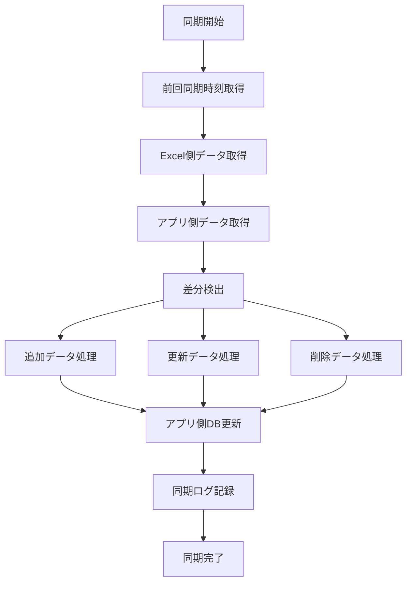

# Excel → アプリケーション WBS単方向同期機能 実装計画書

## 1. 概要

### 1.1 背景
- ExcelでWBSを管理している既存の運用フローが存在
- Excelで行われた追加・更新・削除をアプリケーション側に反映する機能を追加する
- 当アプリケーション側のタスク編集機能が整うまでは、
  - ExcelでのWBS管理を継続
  - アプリケーション側ではWBSの参照機能のみ利用する
- Excelがマスターデータとして機能する

### 1.2 目的
Excel（MySQL）からアプリケーション（PostgreSQL）へWBSデータを単方向同期する機能を実装し、Excelで管理されているWBS情報をアプリケーションに反映する。

## 2. システム構成

### 2.1 データソース

#### MySQL側（Excel管理）
```sql
-- wbsテーブル構造
- ID: 自動採番の主キー
- PROJECT_ID: プロジェクト識別子
- WBS_ID: WBS番号
- TASK: タスク名
- PHASE: フェーズ
- TANTO: 担当者
- KIJUN_START_DATE/END_DATE: 基準日程
- YOTEI_START_DATE/END_DATE: 予定日程
- JISSEKI_START_DATE/END_DATE: 実績日程
- KIJUN_KOSU/YOTEI_KOSU/JISSEKI_KOSU: 各種工数
- STATUS: ステータス
- PROGRESS_RATE: 進捗率
```

#### アプリケーション側（PostgreSQL）
```typescript
// 主要エンティティ
- Wbs: WBS本体
- WbsTask: タスク（taskNoがWBS_IDに相当）
- WbsPhase: フェーズ
- WbsAssignee: 担当者割り当て
- TaskPeriod: タスク期間（基準/予定/実績）
- TaskKosu: 工数情報
```

### 2.2 マッピング定義

| MySQL (wbs) | PostgreSQL | 備考 |
|-------------|------------|------|
| PROJECT_ID | Projects.Name | プロジェクトの紐付け |
| WBS_ID | WbsTask.taskNo | タスク番号 |
| TASK | WbsTask.name | タスク名 |
| PHASE | WbsTask.PhaseId, WbsPhase | フェーズ名(存在しない場合は作成) |
| TANTO | WbsAssignee.assigneeId | 担当者ID（要変換 存在しない場合はスキップ） |
| KIJUN_START_DATE/END_DATE | TaskPeriod (type=BASELINE) | 基準日程 |
| YOTEI_START_DATE/END_DATE | TaskPeriod (type=PLANNED) | 予定日程 |
| JISSEKI_START_DATE/END_DATE | TaskPeriod (type=ACTUAL) | 実績日程 |
| KIJUN_KOSU | TaskKosu (type=BASELINE) | 基準工数 |
| YOTEI_KOSU | TaskKosu (type=PLANNED) | 予定工数 |
| JISSEKI_KOSU | TaskKosu (type=ACTUAL) | 実績工数 |
| STATUS | WbsTask.status | ステータス（要マッピング） |
| PROGRESS_RATE | WbsProgressHistory | 進捗率(当アプリケーションには存在しない項目のため今後実装予定) |

## 3. 同期戦略

### 3.1 更新検知メカニズム

#### 全件比較方式
- Excel側の全データを取得
- アプリケーション側と比較して差分を検出
- シンプルだが大量データ時は非効率

#### 同期ログテーブル
```sql
CREATE TABLE sync_logs (
  id SERIAL PRIMARY KEY,
  project_id VARCHAR(50),
  sync_status VARCHAR(20), -- 'SUCCESS', 'FAILED', 'PARTIAL'
  synced_at TIMESTAMP,
  record_count INTEGER,
  added_count INTEGER,
  updated_count INTEGER,
  deleted_count INTEGER,
  error_details JSONB,
  created_at TIMESTAMP DEFAULT CURRENT_TIMESTAMP
);
```

### 3.2 データ同期ポリシー

#### 基本原則
- **Excel側がマスター**: 常にExcel側のデータを正とする
- **DELETE-INSERT**: アプリ側のデータを全削除し、Excel側のデータを再挿入

<!-- #### 追加の検知方法
- **WBS_NOの存在確認**: アプリ側に存在しないWBS_NOを追加対象とする

#### 更新の検知方法
- **WBS_NOの変更確認**: アプリ側に存在するWBS_NOの変更を検出し、更新対象とする

#### 削除の検知方法
1. **差分方式**: Excel側に存在しないデータを削除対象とする -->

### 3.3 同期フロー



## 4. アーキテクチャ設計

### 4.1 レイヤー構成

```
┌─────────────────────────────────────┐
│         Presentation Layer          │
│    (同期実行UI, 履歴表示, 進捗表示)    │
└─────────────────────────────────────┘
                  ↓
┌─────────────────────────────────────┐
│        Application Layer            │
│     (WbsSyncApplicationService)     │
└─────────────────────────────────────┘
                  ↓
┌─────────────────────────────────────┐
│          Domain Layer               │
│    (WbsSyncService, DataMapper)     │
└─────────────────────────────────────┘
                  ↓
┌─────────────────────────────────────┐
│       Infrastructure Layer          │
│ (ExcelWbsRepository, SyncLogRepo)   │
└─────────────────────────────────────┘
```

### 4.2 主要インターフェース

```typescript
// ドメイン層
interface IWbsSyncService {
  // Excel側データ取得
  fetchExcelData(projectId: string): Promise<ExcelWbs[]>;
  
  // 変更検出
  detectChanges(
    excelData: ExcelWbs[],
    appData: WbsTask[]
  ): Promise<SyncChanges>;
  
  // 変更適用
  applyChanges(changes: SyncChanges): Promise<SyncResult>;
}

// 変更データ構造
interface SyncChanges {
  projectId: string;
  toAdd: ExcelWbs[];      // 新規追加するデータ
  toUpdate: ExcelWbs[];   // 更新するデータ
  toDelete: string[];     // 削除するWBS_ID
  timestamp: Date;        // 同期実行時刻
}

// インフラ層
interface IExcelWbsRepository {
  findByProjectId(projectId: string): Promise<ExcelWbs[]>;
  findByProjectIdSince(
    projectId: string, 
    since: Date
  ): Promise<ExcelWbs[]>;
  findDeletedSince(
    projectId: string,
    since: Date
  ): Promise<string[]>; // 削除されたWBS_IDのリスト
}

interface ISyncLogRepository {
  getLastSync(projectId: string): Promise<SyncLog | null>;
  recordSync(log: SyncLog): Promise<void>;
  getHistory(
    projectId: string, 
    limit?: number
  ): Promise<SyncLog[]>;
}
```

### 4.3 データ変換層

```typescript
class WbsDataMapper {
  // Excel → App変換
  static toAppWbs(excelWbs: ExcelWbs): {
    task: Partial<WbsTask>;
    periods: Partial<TaskPeriod>[];
    kosus: Partial<TaskKosu>[];
  } {
    return {
      task: {
        taskNo: excelWbs.WBS_ID,
        name: excelWbs.TASK,
        status: this.mapStatus(excelWbs.STATUS),
      },
      periods: this.mapPeriods(excelWbs),
      kosus: this.mapKosus(excelWbs),
    };
  }
  
  // 削除判定
  static getDeletedWbsIds(
    excelData: ExcelWbs[],
    appTasks: WbsTask[]
  ): string[] {
    const excelWbsIds = new Set(excelData.map(e => e.WBS_ID));
    return appTasks
      .filter(task => !excelWbsIds.has(task.taskNo))
      .map(task => task.taskNo);
  }
}
```

## 5. 実装計画

### Phase 1: 基盤構築（1週間）
- [ ] 同期ログテーブルの作成
- [ ] MySQL接続設定（Prisma第2データソース）
- [ ] ExcelWbsRepositoryの実装
- [ ] SyncLogRepositoryの実装
- [ ] 基本的なデータマッパーの実装

### Phase 2: 同期コア機能（1.5週間）
- [ ] 変更検出アルゴリズムの実装
- [ ] データマッピングロジックの実装
- [ ] トランザクション管理の実装
- [ ] エラーハンドリングとロールバック
- [ ] 削除検知ロジックの実装

### Phase 3: アプリケーションサービス（1週間）
- [ ] WbsSyncApplicationServiceの実装
- [ ] 同期実行のユースケース実装
- [ ] バッチ処理対応
- [ ] スケジュール実行対応

### Phase 4: UI/UX実装（0.5週間）
- [ ] 同期実行ボタンの追加
- [ ] 同期履歴表示画面
- [ ] プログレス表示
- [ ] 成功/エラー通知
- [ ] 最終同期日時の表示

### Phase 5: テストと最適化（1週間）
- [ ] ユニットテストの作成
- [ ] 統合テストの作成
- [ ] パフォーマンステスト
- [ ] 大量データでの検証
- [ ] 最適化とチューニング

## 6. 技術的考慮事項

### 6.1 トランザクション管理
- アプリケーション側DBのみのトランザクション
- 一括更新によるアトミック性の確保
- 部分的な失敗時のロールバック戦略

### 6.2 パフォーマンス最適化
- バッチ処理による一括更新
- インデックスの最適化
- キャッシュの活用
- 差分同期による転送量削減

### 6.3 エラーハンドリング
```typescript
class SyncError extends Error {
  constructor(
    message: string,
    public readonly type: SyncErrorType,
    public readonly details: any
  ) {
    super(message);
  }
}

enum SyncErrorType {
  CONNECTION_ERROR = 'connection_error',
  VALIDATION_ERROR = 'validation_error',
  MAPPING_ERROR = 'mapping_error',
  TRANSACTION_ERROR = 'transaction_error',
}
```

### 6.4 監視とログ
- 同期実行時間の記録
- エラー率の監視
- データ不整合の検知
- アラート通知

## 7. セキュリティ考慮事項

- データベース接続の暗号化
- 認証・認可の実装
- 監査ログの記録
- 個人情報の適切な処理

## 8. 運用考慮事項

### 8.1 定期同期
- Cronジョブによる定期実行
- 実行間隔の設定（例：1時間ごと）
- 営業時間外の自動同期

### 8.2 手動同期
- オンデマンド実行機能
- 特定プロジェクトのみの同期
- 同期前の確認ダイアログ

### 8.3 障害対応
- 同期失敗時の自動リトライ
- エスカレーション手順
- データ復旧手順

## 9. 今後の拡張性

- リアルタイム同期（変更検知トリガー）
- 他システムとの連携
- 同期対象フィールドのカスタマイズ
- 差分表示機能

## 10. リスクと対策

| リスク | 影響度 | 発生確率 | 対策 |
|-------|--------|---------|------|
| データ不整合 | 高 | 低 | トランザクション管理、検証ロジック |
| パフォーマンス劣化 | 中 | 中 | バッチ処理、インデックス最適化 |
| 同期失敗 | 高 | 低 | リトライ機構、エラー通知 |
| 誤削除 | 高 | 低 | 論理削除、削除前確認 |

## 付録A: 用語集

- **WBS (Work Breakdown Structure)**: 作業分解構造
- **同期 (Synchronization)**: Excel側のデータをアプリケーション側に反映する処理
- **差分検出 (Diff Detection)**: 前回同期時からの変更を検出する処理
- **マッピング (Mapping)**: 異なるデータ構造間の対応関係

## 付録B: 参考資料

- [Prisma Multiple Database Sources](https://www.prisma.io/docs/concepts/components/prisma-schema/data-sources)
- [分散トランザクション管理](https://microservices.io/patterns/data/saga.html)
- [Change Data Capture Pattern](https://debezium.io/documentation/reference/stable/tutorial.html)